# Git & GitHub

A l'issu de cette séquence, vous serez capable de :


- Comprendre le principe de fonctionnement d'un gestionnaire de code source
- Valider des modifications locales
- Créer un dépôt distant (GitHub)
- Synchroniser le dépôt local avec le dépôt distant
- Consulter l'historique des modifications


## Présentation

**Git** est un **logiciel** de **gestion** de **versions** (VCS Version Control System), c’est un outil permettant de gérer vos projets, de stocker un ensemble de fichiers, en conservant la chronologie de toutes les modifications, et qui permet ainsi de retrouver les différentes versions enregistrées.


**GitHub** est la **plateforme** qui permet d’**héberger** vos différents **projets**.

Ainsi, afin de pouvoir utiliser **GitHub**, il est nécessaire d’installer **Git** puis de créer  un compte sur **GitHub**.

## Installation de Git

Allez sur [https://git-scm.com](https://git-scm.com/) et **téléchargez git**. 

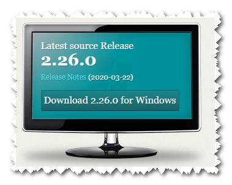

Rien de spécial à cocher : next, next … valeurs par défaut !

Une fois **GIT installé**, allez sur votre bureau, puis clic droit.

Vous devriez alors avoir **Git GUI Here** & **Git Bash Here** dans la fenêtre qui s’ouvre comme montré ci-dessous :

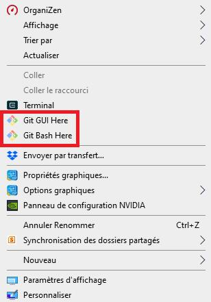

## Configuration de Git

Maintenant que **Git** est installé, vous allez devoir le **configurer** grâce à la commande `$ git config`

Pour ce faire, **clic droit** sur votre **bureau**, **Git Bash Here**

Renseignez votre **nom d'utilisateur** :
```bash
$ git config --global user.name "Nom prenom"
```
Puis votre **adresse mail** :
```bash
$ git config --global user.email "adresse@mail.fr"
```
Ces deux commandes permettront à chacun de vos **commits** d'être **identifiés** par défaut :

Ex :
```bash
$ git config --global user.name "manu"
```
```bash
$ git config --global user.email "manu@afpa.fr"
```

Pour **modifier** la **configuration globale** : 

`$ git config --global --replace-all user.name "New User Name"`

`$ git config --global --replace-all user.email "New User Email"`

Pour **afficher** la **liste** des **informations** saisies dans **config** : 

`$ git config --global --list`


Vous retrouverez les informations saisies, lors de la visualisation des commits en tapant `$ git log` :

<span style="color :red">**Pour le moment**, **ne testez pas cette commande**</span>, car vous n’avez pas encore réalisé de commit !

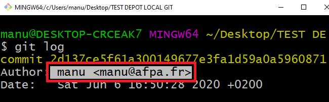

### Pour information : 


**Global** : configuration par défaut

Si vous saisissez `$ git config --global user.name ‘’…’’`et `$ git config --global user.email’’…’’`, sur une machine concernée, il s’agit de la **configuration par défaut**. 

C’est-à-dire que si vous créez d’autres dépôts en local et que vous ne renseignez pas la config user.name et user.email, la config sera celle par défaut.

Si sur d’autres dépôts vous désirez avoir une **autre configuration, que celle par défaut**, il faudra dans le dépôt concerné faire un `$ git config` et renseigner votre user.name et votre user.email :

`$ git config user.name ’’…’’` et `$ git config user.email ’’…’’`

## Création du dépôt local

Créez sur le bureau un nouveau dossier, que l’on désire déposer sur GitHub, dans lequel vous placerez par la suite vos fichiers de travail.

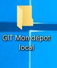
  
Puis allez dans ce dossier, clic droit puis **Git Bash Here**.


## Initialisation du dépôt Git

Saisir la commande `$ git init`:

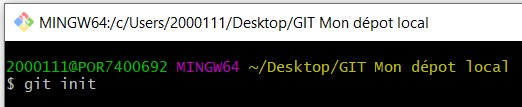

La commande `$ git init` permet d’initialiser le dépôt Git pour le projet concerné et ainsi de générer un ‘**.git**' dans ledit dossier :

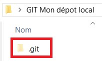

Attention : le dépôt se trouve dans le dossier .git ! <span style="color:red">**Ne jamais supprimer**</span>

Depuis le terminal **git bash**, taper `$ touch README` :

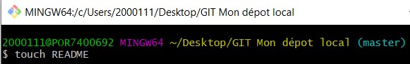

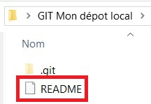
 

Cette commande permet de créer le fichier **README** dans le répertoire courant.

Maintenant ouvrir ce fichier et sauvegarder un court message.

 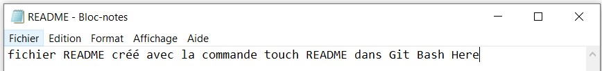

**Commit** : un commit permet valider une sauvegarde locale dans **.git**, des différentes modifications apportées à votre projet.

Un commit s'opère en 3 étapes (faire un **S A C**):

•	**Status** (Vérification)

•	**Add** (Ajout des fichiers, de toutes les modifications réalisées à l’index)

•	**Commit** (Validation)

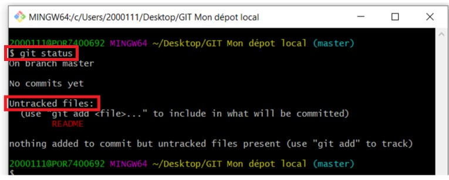


**Attention** : respecter la **casse** (**minuscule MAJUSCULE**)  de vos fichiers et l’extension si existante ! 

Saisir exactement comme présenté par Git, et s’il y a des espaces dans le nom du fichier, saisir le nom du fichier entre ‘’ ‘’

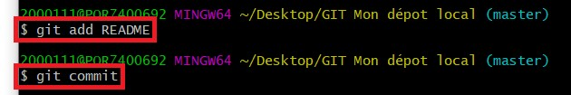 

Lorsque vous faites un commit, **git** va vous ouvrir **vim** : l'éditeur de texte par défaut de git dans le terminal.


**Pour information** : `$ git commit -m "message du commit"`, permet de faire un commit sans passer par un éditeur par défaut. 


**Appuyer** sur la touche **i** pour vous mettre en mode "**insertion**".  

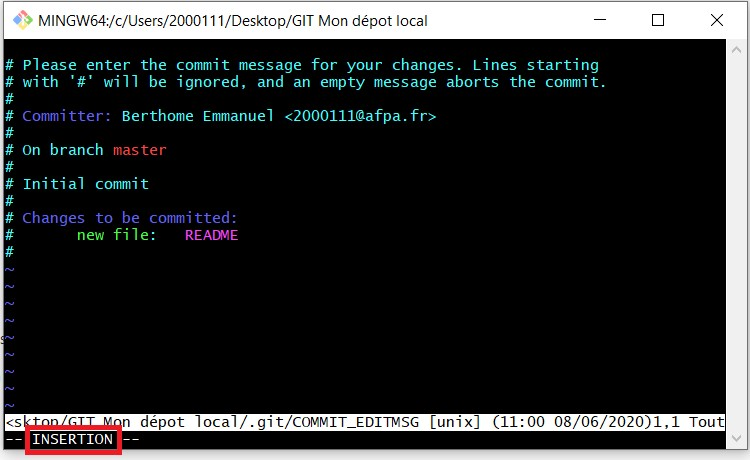

Vous pouvez alors entrer votre message de commit.

Une bonne habitude à prendre est de commencer par un titre général et ensuite d'expliquer en quelques mots le contenu du commit.

Pour sauvegarder faites **Esc** pour quitter le mode "insertion" puis tapez **:wq** pour sauvegarder(w pour "write") puis quitter(q pour "quit")

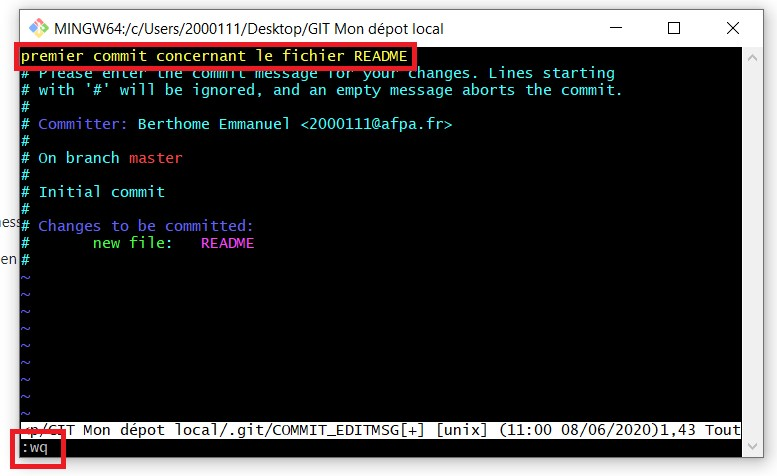

### Pour information : 

Il se peut, si vous avez installé VS code sur votre machine, que vous n’ayez pas la même console comme ci-dessus mais la console propre à VS code, comme montré ci-dessous :

Sur le dépôt local, création d’un **doc.txt** … 

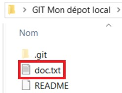

puis **Status Add** puis **Commit**

Saisissez alors votre **message** pour votre **commit**: 

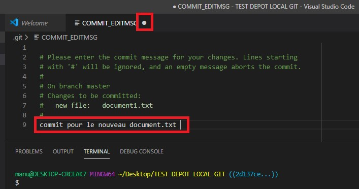 

Une fois le message de votre commit saisi, pour confirmer, il suffit d’enregistrer et de fermer le fichier :

**Ctrl+s** puis fermer le fichier

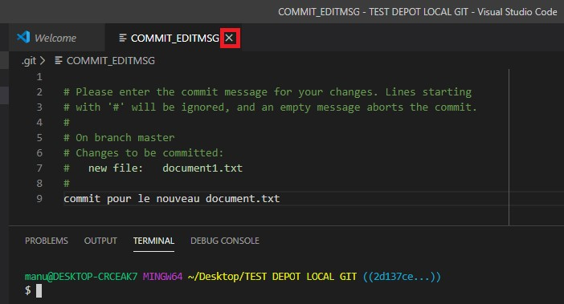

Ainsi, vous vous retrouvez de nouveau dans **Git Bash**.

## Création de compte sur GitHub

Aller sur le site officiel : https://github.com/  afin de créer un compte GitHub.


## Création du dépôt distant

Un **dépôt distant** est un dépôt qui sert à centraliser les modifications apportées par tous les collaborateurs.

Sur le site **GitHub**, créez votre dépôt distant.

Allez sur votre compte et sélectionnez vos dépôts :


Puis New :

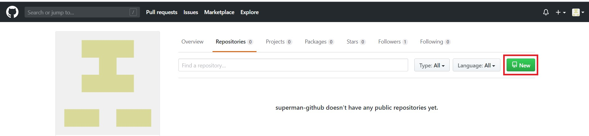

### Nommez votre dépôt distant

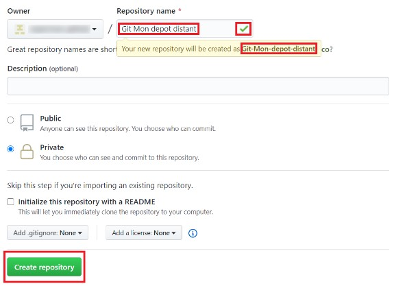

## Création de la liaison entre le dépôt local et le dépôt distant

Une fois le dépôt distant créé, on se trouve à l’intérieur de celui-ci, qui pour le moment est vide, et on découvre son adresse sur GitHub :

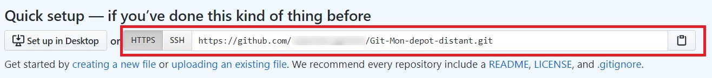

Désormais, nous pouvons, et nous devons, faire la **liaison** entre notre **dépôt local** et notre **dépôt distant**, 
grâce à la commande `$ git remote add origin` et l’adresse HTTPS –SSH :

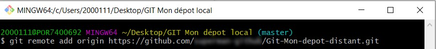

### Push

Enfin, pour enregistrer le dépôt local vers le dépôt distant, il suffit de ‘’**faire un push**‘’ en utilisant la commande
`$ git push -u origin master` pour le tout **premier Push**, puis `$ git push` pour tous les **nouveaux push**.

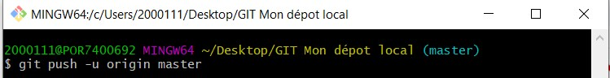

  
 		
Saisir son **Username** et son **Password** lors du **premier Push**, puis plus nécessaire car GitHub installe un **token** sur la machine concernée. 

Votre dépôt local, ci-dessous, doit se trouver sur votre dépôt distant :

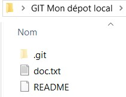

Hormis le ‘**.git**’, vous devez avoir les mêmes fichiers sur **GitHub** :

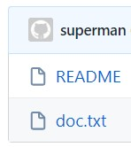

### Pull

Comme pour le Push, le premier Pull doit s’écrire comme suit :

`$ git pull origin master` pour le tout **premier Pull**, puis `$ git pull` pour tous les **nouveaux Pull**.

Avant le Pull dans le dossier local :


Puis sur GitHub, création d’un nouveau fichier (là je vous laisse chercher un peu … pour avoir le résultat ci-dessous)

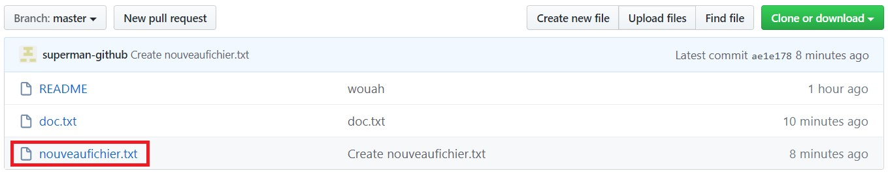  

Puis **Pull** …

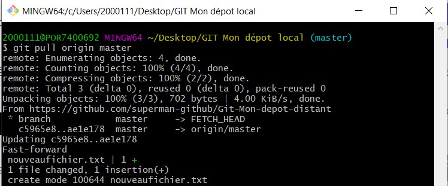 

Pour **info**, quand on fait un **Pull**, **GitHub** fait un **commit**, que l’on distingue en faisant un `$ git log` !

**Après le Pull** dans le dossier local :

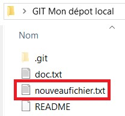

## Git Log

Git gère la chronologie des **commits** en rattachant chaque commit, au commit précédent de sorte que l'on peut visualiser cet historique comme un arbre. 

Pour retrouver un **commit**, il suffit donc de remonter la chaine des commits créés à partir de celui-là.

Pour afficher l'historique des différents **commits** de votre dépôt, utilisez la commande `$ git log`.

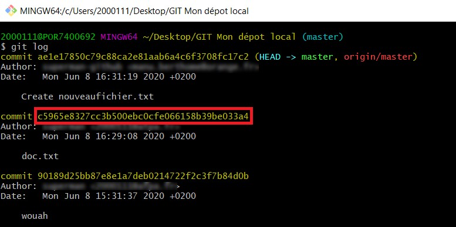

## Git checkout

Chaque commit est identifié par un numéro sha (la ligne inscrite en jaune).

On y retrouve également l'auteur ainsi que la date du commit. 

Puis vient enfin le message de commit : Create nouveaufichier.txt, doc.txt, wouah.

Grâce à toutes ces informations, vous allez pouvoir vous déplacer dans l'arborescence de votre projet pour revenir à un état spécifique de celui-ci.

Pour cela, vous allez utiliser la commande `$ git checkout` avec au moins les 5 premiers caractères de la ligne jaune.

Si par exemple, on veut revenir **avant le pull**, on va faire un `$ git checkout` juste avant le commit concerné :

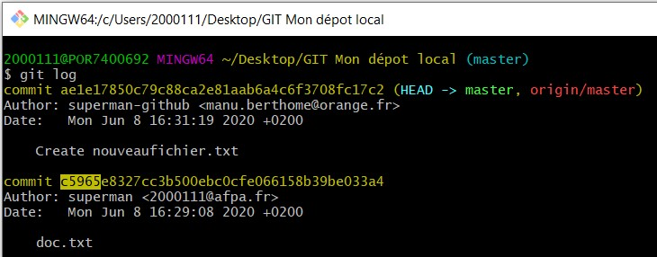

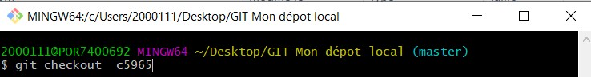

On est bien revenu à l’état avant le Pull : on a plus le ‘’nouveaufichier.txt’’

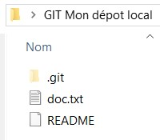

Si on fait un `$ git log`, on ne voit plus, et c’est tout à fait normal, les commits au-dessus du commit vers lequel on est revenu ( c'est comme le petit poucet qui fait marche arrière et reprend ses cailloux … il ne voit plus son chemin de devant !) :

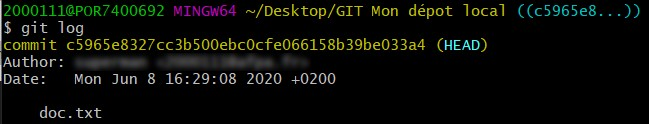 

Pour voir ces commits , il faut revenir sur le ‘’head’’ (point le plus haut) de la branche concernée, en faisant un `$ git checkout master` (**master**, **car** on est dans cet exemple, sur la **branche master**).

 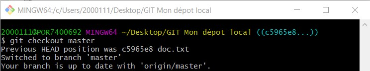

On peut ainsi revenir sur d’autres commits qui se trouvent au-dessus du dernier checkout réalisé.

## Git clone

`$ git clone` permet de **récupérer en local**, **un dépôt distant**. 

Il vous suffit de préciser l'adresse de ce dépôt distant.

Pour récupérer l’**adresse** de votre **dépôt distant**, aller sur ledit dépôt puis **Clone or download** :

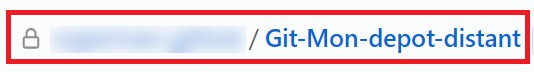

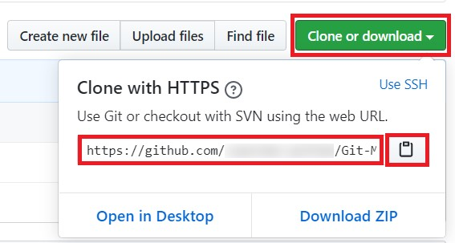  

Copier l’adresse en cliquant sur le lien prévu à cet effet à côté de l’adresse.

Sur votre bureau, `Git Bash Here` puis saisir la commande `$ git clone` et coller l’adresse :

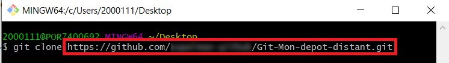 

Le dépôt distant est cloné sur le bureau :

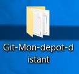 

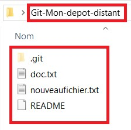 

## Suppression d’un dépôt distant

Pour **supprimer** un **dépôt distant**, allez dans votre dépôt distant, puis **settings**

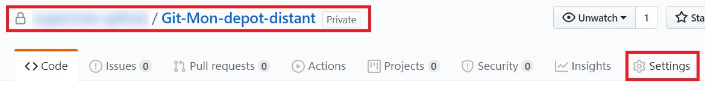 

### Tout en bas de la page :

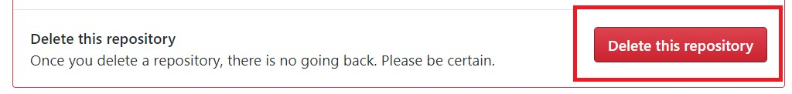  

### Réécrire votre le nom de votre dépôt :

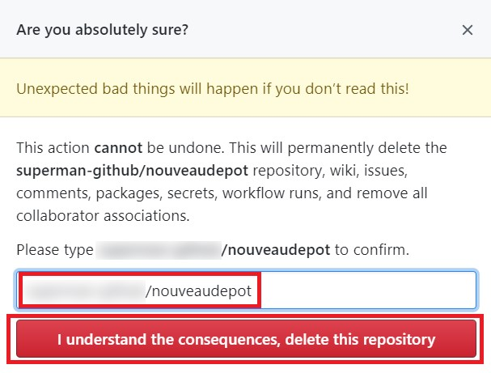    	

### Confirmer votre mot de passe :	

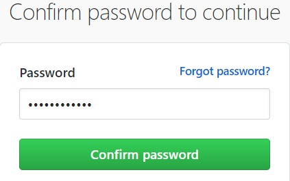   

Votre dépôt distant, préalablement sélectionné, a été supprimé de votre compte GitHub !

## Inviter un collaborateur sur Git Hub

Allez dans votre dépôt distant que vous désirez partagé, 

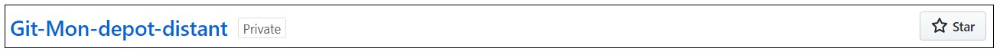 

Ensuite **Settings** puis **Manage access** 

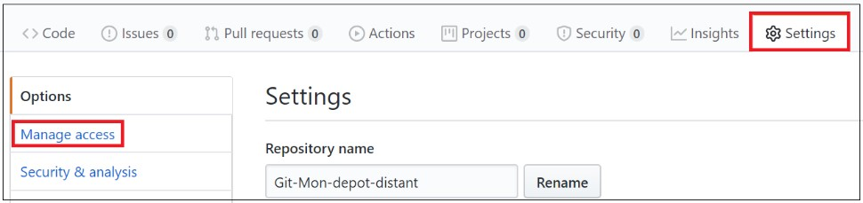  

Votre mot de passe vous sera alors peut être demandé, puis : 

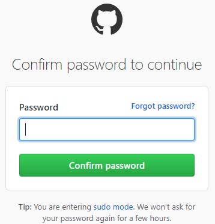 

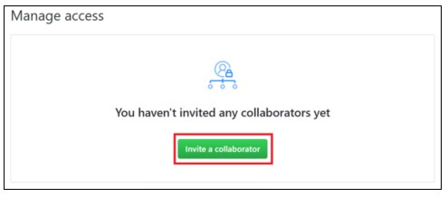 

**Renseignez** alors **le pseudo GitHub** de votre collaborateur :

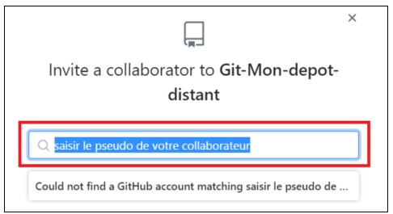 

Votre collaborateur, devrait alors recevoir un mail d’invitation, en attente d’acceptation.

## Suppression d’un dépôt dont vous êtes collaborateur

Cliquez en haut à droite, puis **Settings** :

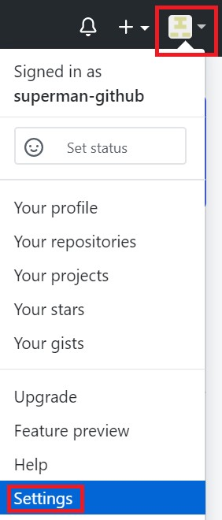

Ensuite **Repositories** :

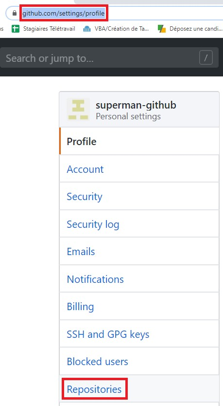

Sélectionnez un dépôt dont vous êtes collaborateur :

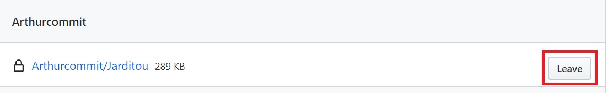

 
Puis **Leave** :

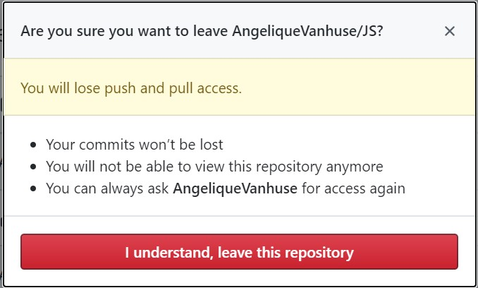

Vous venez de supprimer le dépôt dont vous étiez collaborateur.

## Lignes de commande ‘’Bash’’ :

**Pour info** : sous les systèmes de type UNIX, **~** appelé **tildé**, désigne le **répertoire** de l’**utilisateur courant**.

`~ = C:\Users\manu\` par exemple.

Sur votre bureau, **Git Bash Here**

•	`mkdir`


**make directory** ‘’mon depot local’’ : créé un répertoire ‘’mon depot local’’ sur votre bureau. 


•	` cd`   


**change directory** : change de répertoire, permet de se rendre dans le répertoire concerné ‘’mon depot local’’

•	` touch` 


Créé un fichier : README 


Créé un fichier : fichier.txt 


•	` $ clear`  : permet de **nettoyer** la **console Bash**.

## Lignes de commande ‘’Git’’ de base :

### CONFIG

`$ git config --global user.name ‘’nom prenom’’` par défaut OU `$ git config user.name ‘’nom prenom’’`

`$ git config --global user.email ‘’adresse@mail.fr’’`  par défaut  OU `$ git config user.email ‘’adresse@mail.fr’’`

Pour **modifier** la **configuration globale** : 

`$ git config --global --replace-all user.name "New User Name"`

`$ git config --global --replace-all user.email "New User Email"`

Pour **afficher** la **liste** des **informations** saisies dans **config** : 

`$ git config --global --list`

### INITIALISATION

`$ git init` : initialisation du dépôt

### COMMIT : faire un SAC

**S** `$ git status`

**A** `$ git add`	

**C** `$ git commit`

### LIAISON

`$ git remote add origin https://.......` : Liaison entre dépôt local et distant grâce à l'adresse de votre dépôt distant.

### PUSH / PULL

`$ git push -u origin master` puis `$ git push` : pour pousser vers votre dépôt distant

`$ git pull origin master` puis `$ git pull` : pour tirer vers votre dépôt local.

### LOG

`$ git log` : pour lister les différents commits réalisés.

### CHECKOUT

`$ git checkout` : permet de se déplacer dans l’arbre

Pour se placer sur une branche précise :  `$ git checkout <nom de la branche à atteindre>`

Pour se placer sur la branche principale	: `$ git checkout master`

Pour se placer à un commit précis :	`$ git checkout <N° correspondant au commit concerné>`

**Rappel** : minimum les 5 premiers chiffres

## Bonnes pratiques :

•	En équipe, toujours faire un **fetch**, `$ git fetch`, avant de commencer à apporter des modifications et avant de réaliser des commits : 

le cas échéant lors d’un Push ou d’un Pull, Git vous le fera savoir ! :

```bash
	Fetch -> pull (fetch + merge)-> push
```

Pour **information** :

La commande `$ git fetch` va **récupérer** toutes les données des **commits** effectués sur la branche courante **qui n'existent pas encore** dans votre version en local. 

Ces **données** seront **stockées** dans le répertoire de travail local **mais** ne seront **pas fusionnées** avec votre branche locale. 

Si vous souhaitez **fusionner** ces données pour que votre branche soit à jour, vous devez **utiliser** ensuite la commande  `$ git merge`, sur la branche destinataire.


•	Écrire des **commentaires clairs**, **explicite**.

Pour **information**, vous pouvez faire un ‘’**commit commun**’’ regroupant la modification de plusieurs fichiers.

•	Créer des **branches** par **développeurs** et par **fonctionnalités**.

•	<span style="color:red">**Commiter que du code qui fonctionne !**</span>


## $ git gui&

Pour visualiser les différents commit réalisés, l’historique de toutes les branches : 


 

  Historique de toutes les branches : dépôt distant et local, revient à saisir, `$ gitk--all`, directement dans la **console Git**. 

   Historique des branches du dépôt local, revient à saisir, `$ gitk`, directement dans la **console Git**.

## VS code

Dans VS code, pour visualiser les différents commit réalisés, l’historique de toutes les branches : 

Cliquez sur :

  

Si on a **powershell**, sélectionner **Select Default Shell** puis **Git Bash** :

 

   

Refermer le Terminal puis l’ouvrir de nouveau :

 

Saisir la commande `$ git gui&`:

 

On a :


## Pour aller plus loin

`$ git pull` : permet de mettre à jour les branches déjà connues sur le dépôt local à partir du dépôt distant.

`$ git fetch` : permet de récupérer toutes les nouveautés du répertoire distant, c’est-à-dire, les branches connues, mais aussi les branches pas encore connues du dépôt local.

**Rappel** : en équipe, toujours faire un fetch avant de commencer à apporter des modifications et avant de réaliser des commits : le cas échéant lors d’un Push ou d’un Pull, Git vous le fera savoir ! :

```bash
Fetch -> pull (fetch + merge)-> push
```

`$ git remote –v` : permet de voir les dépôts distants rattachés au dépôt local.

`$ git branch <nom de votre nouvelle branche>` : permet de créer une nouvelle branche.

`$ git merge <nom de la branche>` : permet de fusionner 2 branches entre elles, pour cela ; se mettre sur la branche destinataire.

`$ gitk--all` : dessine toutes les branches du dépôt distant + local. Cf.Screenshot plus haut

`$ gitk` : dessine les branches du dépôt local.

`$ git branch` : permet d’afficher toutes les branches du dépôt local.

`$ git branch –a` : permet d’afficher toutes les branches du dépôt local mais aussi du dépôt distant. 


`$ git add .` : permet d’enregistrer toutes les modifications dans le dossier concerné.

Si vous êtes dans un sous dossier, les modifications des dossiers de niveaux supérieurs ne seront pas enregistrées.

