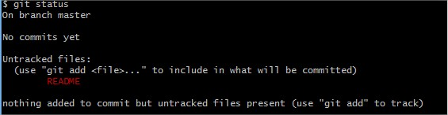
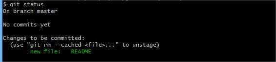
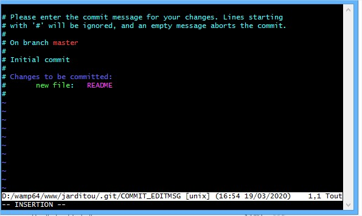
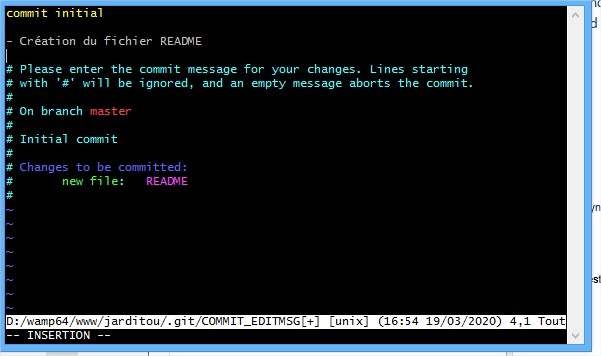

# GIT COMMIT

Git permet, comme nous l'avons dit précédemment, de conserver l'historique chronologique des modifications. Vous pouvez visualiser cet historique comme une corde de noeuds. A chaque noeud serait attaché un sac contenant les dites modifications. Ces sacs representent vos commits.

Puisque vous avez maintenant un dépôt initialisé et configuré, le travail peut commencer.

Dans un premier temps, vous allez créer un fichier **README** qui contiendra différentes informations relatives au projet.

Depuis le terminal git bash, tapez:

    touch README

Cette commande vous permet de créer le fichier **README** dans le répertoire courant.

Maintenant ouvrez ce fichier et inscrivez-y une courte description du projet _Jarditou_ puis sauvegardez-le.

### Premier commit

Il est maintenant temps de faire votre premier commit.

Un commit s'opère en 3 étapes:

* **S**tatus (Vérification)
* **A**dd (Ajout)
* **C**ommit (Validation)

##### Les zones dans git

Sachez que git s'organise en découpant votre dépot local en 3 zones:

* Votre espace de travail
* Une zone de transit appelé **index** ou **staging area**
* le dépot propement dit (qui contient l'historique)

Par défaut, git détecte tout changement dans votre répertoire courant. C'est à dire que votre dépot git a déjà perçu la création du fichier **README**

##### git status

La commande `git status` vous permet de connaitre l'état de votre espace de travail par rapport à votre dépôt. Pour le moment votre dépôt est vide, donc toute differences par rapport à cet état doit être détectée.

Tapez la commande `git status` dans votre terminal bash

Cela signifie que git a bien détecté le fichier. Mais pour l'instant il ne sait pas quoi en faire. Notez le **Untracked files** qui signifie qu'il ne fait pas partie de votre dépôt, que git ne suit pas ce fichier. Il vous informe seulement que ce fichier existe dans votre dossier de travail.

##### git add 

Pour pouvoir valider le fichier dans votre dépôt, il faut d'abord l'ajouter à l'**index**. La commande pour ajouter un fichier est `git add`.

    git add README

Vérifiez maintenant que git a bien ajouter votre fichier à l'index

    git status

.

Notez que git identifie cette fois-ci le fichier README comme un nouveau fichier pour le dépôt et que celui-ci sera ajouté au prochain commit.

##### git commit

Il ne vous reste plus qu'à valider la modification. Pour cela, tapez: 

    git commit

++ TODO ++
git va vous ouvrir [vim]() (l'éditeur de texte par défaut de git) dans le terminal

.

Appuyer sur la touche `i` pour vous mettre en mode "insertion". Vous pouvez entrez votre message de commit.

Une bonne habitude à prendre est de commencer par un titre général et ensuite d'expliquer en quelques mots le contenu du commit

.

Pour sauvegarder et quitter tapez `Esc` pour quitter le mode "insertion" puis `:wq` pour sauvegarder(`w` pour "write") puis quitter(`q` pour "quit")

Voilà ! Vous avez réalisé votre premier commit !

#### Exercices

Amusez-vous à créer quelques commits en verifiant les differents états de vos fichiers et montrez votre dépôt à votre formateur.

1 - Combien y a-t-il d'états possibles d'une modification pour git?
2 - Pouvez-vous les citer?
