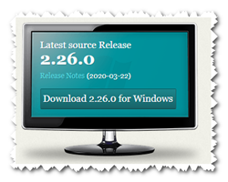
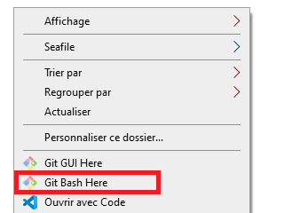
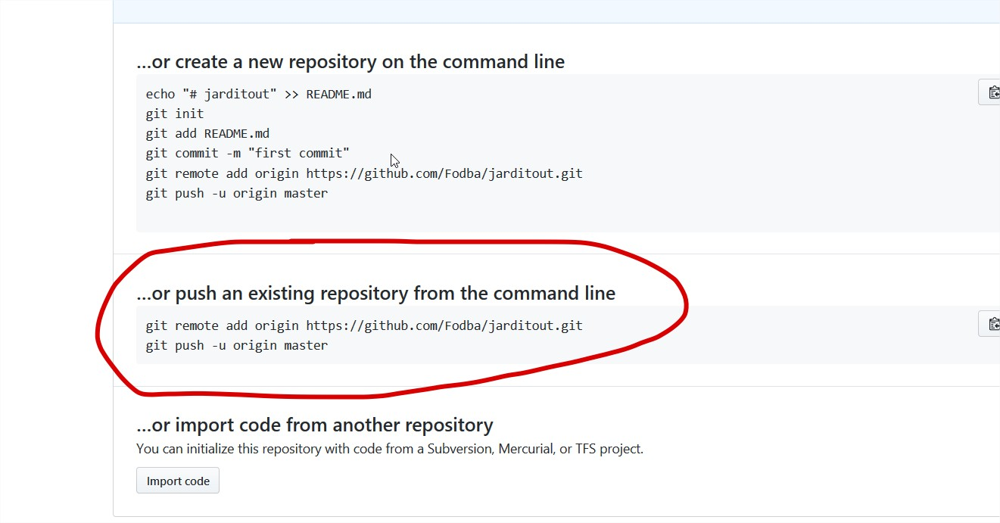
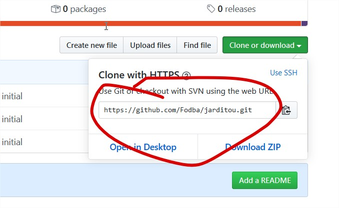

# Git & GitHub

## Présentation

Git est un [logiciel de gestion de version](https://fr.wikipedia.org/wiki/Logiciel_de_gestion_de_versions). Il vous permet, entre autres choses, de conserver un historique chronologique des modifications apportées à votre projet.
Ces modifications sont stockées dans un _dépôt_. Un dépôt est l'endroit où les versions du code source d'un projet seront stockées; concrètement il s'agit d'un répertoire physique sur votre ordinateur.
Un dépôt peut se trouver sur votre PC (on parle alors de _dépôt local_), sur un serveur ou des services cloud telles que Github, on parle alors de _dépôt distant_ (ou _remote_ en anglais).


Assistez à la présentation par votre formateur de ce [document](git.pdf). Vous y découvrirez Git, un outil de gestion de versions.

Il existe de nombreux outils pour utiliser git, notamment des outils graphiques. Vous verrez ici la méthode la plus basique, la ligne de commande avec [git bash](bash.html).

## DEPÔT LOCAL

### Installation


Afin de pouvoir, utiliser GitHub, il est nécessaire d’installer Git

Aller sur [ce site](https://git-scm.com/), téléchargez git et installez le en laissant toutes les valeurs par défaut.




### Configuration

Maintenant que git est installé, vous allez devoir le configurer grace à la commande `git config` ( Faites clique droit sur votre bureau et selectionner "Git Bash Here")

Renseigner votre nom d'utilisateur :

```bash
git config --global user.name "Nom prenom"
```

Puis votre adresse mail :

```bash
git config --global user.email "adresse@mail.fr"
```

Ces deux commandes permettront à chacun de vos commits d'être identifiés.

### Initialisation d'un dépôt git

Vous allez donc créer votre premier dépôt git. Pour cela vous allez créer un répertoire dans lequel vous placerez ensuite vos fichiers de travail.

Ouvrez git bash dans le répertoire concerné (click droit sur le répertoire, puis `Git Bash here`)



Ensuite, tapez la commande suivante

```
git init
```

la commande `init` permet d'initialiser (de créer) le dépôt Git pour le projet

Vérifiez que la commande a bien créé un sous-répertoire `.git` dans votre répertoire de travail.

> Il est possible que le répertoire `.git` ne soit pas visible. Il faut dans ce cas affichier cocher **éléments masqués dans les options d'affichage**.

_Vous pouvez si vous le souhaitez choisir une autre configuration pour ce projet particulier. Dans ce cas, répétez les étapes de configuration sans l'option_ `--global`.


### Commit initial

Vous pouvez maintenant créer [vos premiers commits](commit.html)


### L'historique

Vous allez maintenant apprendre à naviguer dans [l'historique de votre dépôt](log.html).


## DEPÔT DISTANT

Un _dépôt distant_ est un dépôt qui sert à centraliser les modifications apportées par tous les collaborateurs. Ce dépôt peut être situé sur n'importe quel PC à la seul condition qu'il reste accéssible pour tous les collaborateurs.

### Publier

Une fois la video ci dessous visionné vous créerez un compte sur la plateforme [GitHub](https://github.com/) et y publirez vos dêpots.


Vidéo Tuto : [https://www.youtube.com/watch?v=4o9qzbssfII](https://www.youtube.com/watch?v=4o9qzbssfII).

#### Création d'un compte Github et travail via un dépôt distant

Les développeurs du monde entier utilisent la plateforme [GitHub](https://github.com) (27 millions d'utilisateurs !), un service de partage de code. Les projets peuvent être rendus publics (ils sont alors téléchargeables librement) et en mode collaboratif, dans ce cas tout le monde peut contribuer au développement d'un projet.

Créer un compte sur le site. Il vous permettra de publier dans un ou plusieurs dépôts le résultat de votre production.

Créez maintenant sur github un dépôt appélé _jarditou_ que vous lierez avec votre dépot local.



* La première commande indique à git l'adresse où se situe le dépot distant et lui demande de l'identifier localement sous le nom "origin"
* La deuxième demande à git d'envoyer le contenu de notre dépôt local vers le dépôt distant. Cette opération est appelé "faire un **push**".


### Push/Pull

Votre dépôt local et votre dépôt distant sont maintenant liés.

#### Push
Donc lorsque vous souhaitez envoyer votre travail sur le dépôt distant, vous devrez taper la commande
    
    git push

La première fois, vous devrez y ajouter l'option `-u` ainsi que le nom du dépôt distant et celui de la branche à pousser. A l'étape précédente vous aviez tapé: `git push -u origin master` car vous vouliez poussez la branche principale (master) vers le dépôt appelé "origin". Ensuite lorsque vous voudrez poussez la branche master, il vous suffira de taper `git push` et git fera automatiquement le lien.

#### Pull

Lorsqu'à l'inverse, vous souhaitez récupérer en local des modifications présentes sur le dépôt distant, vous tapperez la commande

    git pull

Cette commande a un fonctionnement similaire à la commande `git push` (c'est à dire que vous devrez préciser le nom de la branche que vous souhaitez récupérer)

##### Exercice

Cherchez la commande à entrer la première fois que l'on veut faire un pull et montrez-la à un formateur.


### Clone

Il nous reste à voir la commande `git clone`

Cette commande vous permet de récupérer en local un dépôt distant. Il vous suffit de préciser l'adresse de ce dépôt distant. Git l'identifiera automatiquement sous le nom "origin".

Ouvrez la console git bash sur votre bureau et tapez la commande suivi l'adresse de votre dépôt jarditou




## Ressources complémentaires

* [Un guide Pas à Pas](Pour_resumer.html)
* [Video : Git & GitHub : Le Cours Pour Les Débutants](https://www.youtube.com/watch?v=4o9qzbssfII&t=435s)