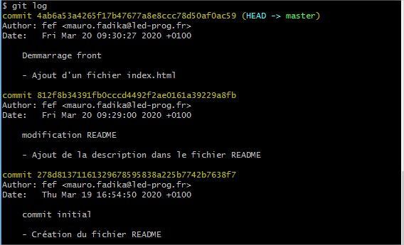

# GIT LOG

Il faut savoir que git gère la chronologie des commits en rattachant chaque commit au commit précédent de sorte que l'on peut visualiser cet historique comme un arbre. Pour retrouver un commit, il suffit donc de remonter la chaine des commits créés à partir de celui-là.

## L'historique

Pour afficher l'historique de votre dépôt utilisez la commande `git log`.

Chaque commit est identifié par un numéro _sha_ (la ligne inscrite en jaune). On y retrouve également l'auteur ainsi que la date du commit. Puis vient enfin le message de commit.
Gràce à toutes ces informations,vous allez pouvoir vous déplacer dans l'arborescence de votre projet pour revenir à un état spécifique de celui-ci.

Si vous souhaitez par exemple revenir sur le premier commit (celui qui est marqué "commit initial"), tapez:

    git checkout 278d81371

La commande `git checkout` vous permet de déplacer la tête (**HEAD**) de votre dépôt vers un commit particulier.

> **HEAD** correspond au dernier commit sur la branche active. Nous reviendrons sur la notion de branche plus tard.

Verifier maintenant dans votre espace de travail pour y trouver les fichiers que vous aviez après le premier commit.

> Pour revenir sur le dernier commit, tapez `git checkout master`

### Exercice

Il existe de nombreuses options à utiliser avec la commande `git log`

- Recherchez les differentes options existantes et leur utilité.
- Presentez à votre formateur 2 commandes permettant d'afficher l'historique de 2 façons differentes.
