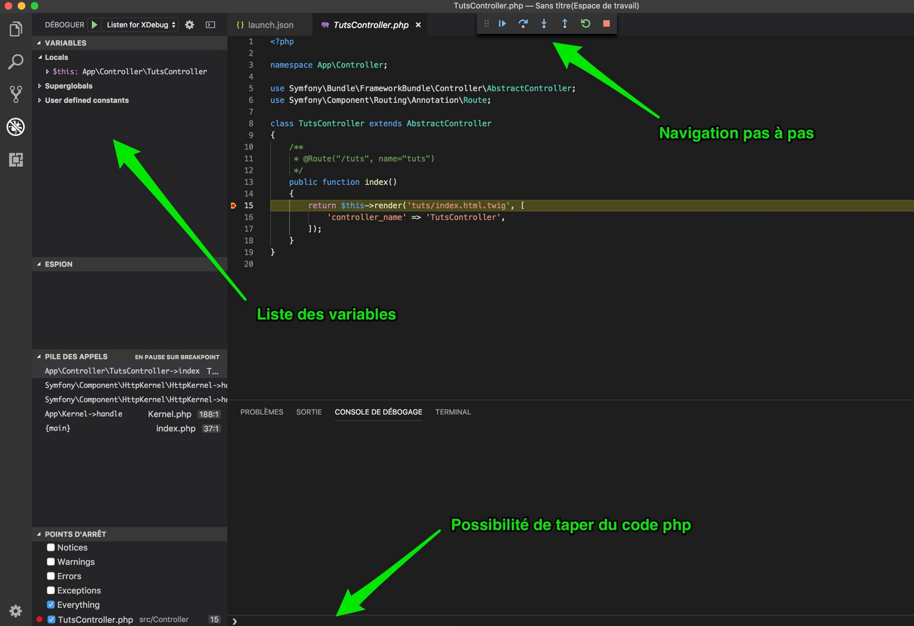
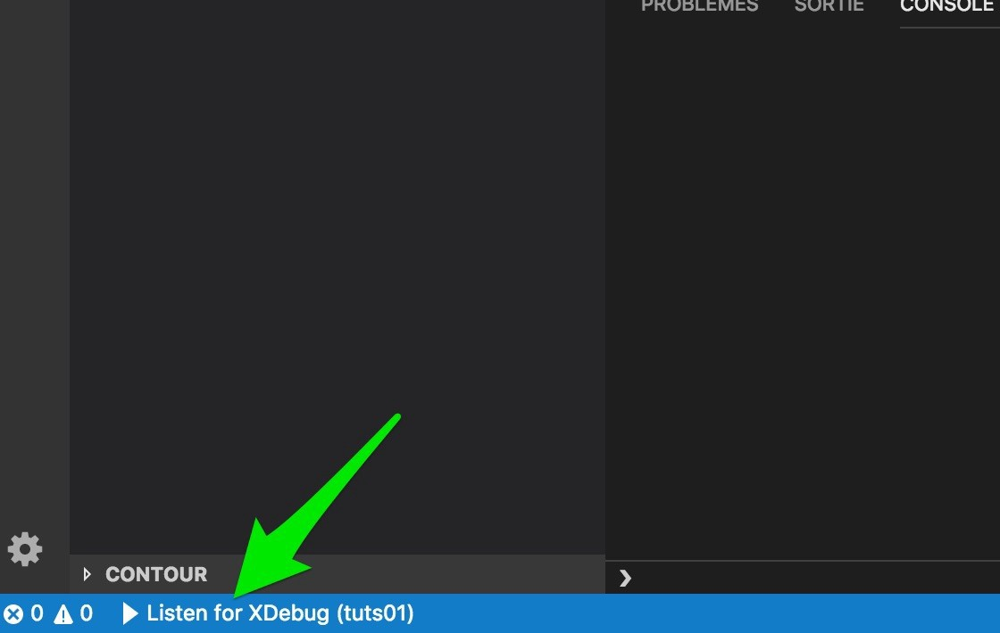

<!-- HB, 14/04/2020 -->

# Travailler avec un éditeur de code > Débogage

L'une des fonctionnalités majeures d'un IDE est le débogage de code : on va pouvoir exécuter un script et visualiser en temps réel ce qui s'y passe, par exemple afficher les valeurs d'une variable, arrêter l'exécution à un endroit précis etc. Fini les `var_dump()` partout !    

VSC embarque en natif un débogueur Javascript (via NodeJS pour être précis), c'est déjà très bien. Regarder [cette vidéo](https://www.youtube.com/watch?v=_imeD5H-yCw) pour en apprendre le fonctionnement. 

Par contre, pour PHP, c'est un peu plus compliqué car il faut tout configurer manuellement : 

* 1ère étape : clic droit sur l'icône Wamp (barre de lancement rapide), aller dans _PHP_ > _Configuration PHP_, cliquer sur la ligne *xdebug.remote_enable* pour l'activer (une coche verte apparaît devant). Wamp va redémarrer.
* 2ème étape : VSC requiert l'extension _PHP Debug_ (de Felix Becker). 

Le fonctionnement du débogueur PHP est le même que pour le Javascript. Vous pouvez visionner la 1ère partie de [cette vidéo](https://www.youtube.com/watch?v=8HidJasG_ds) pour en apprendre davantage. 

En résumé :

Lancer le débogage avec la touche _F5_ : 

