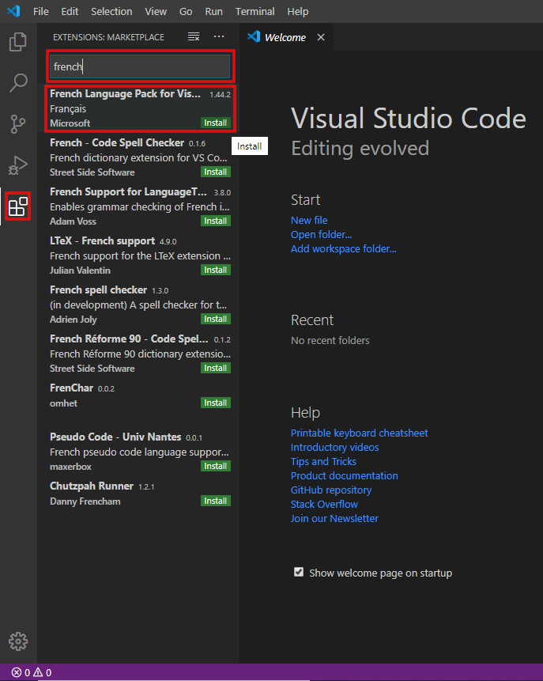
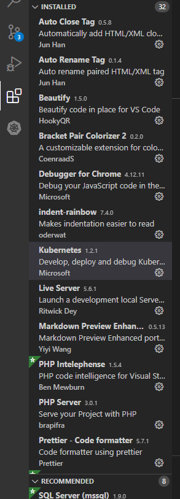
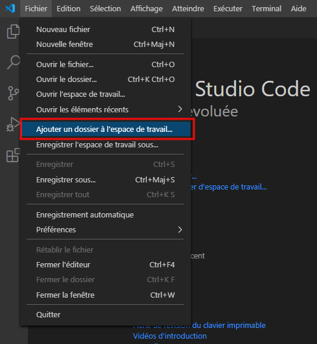
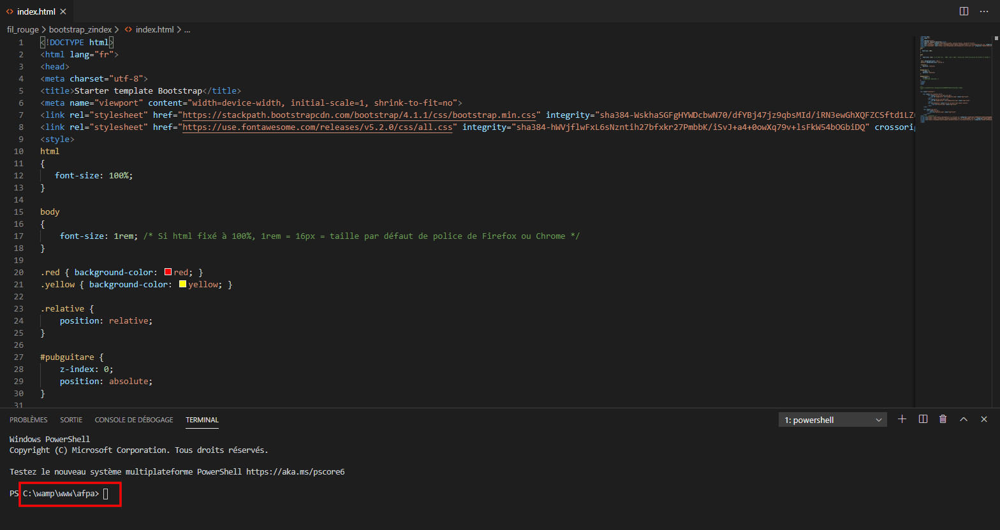
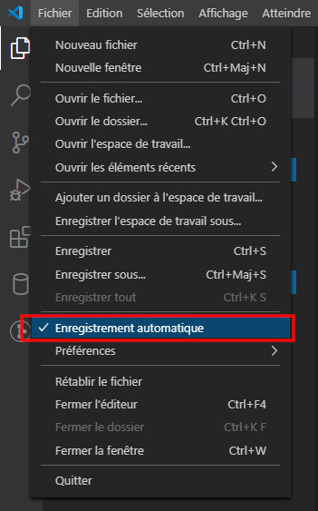

<!-- HB, 08/04/2020 -->

# Travailler avec un éditeur de code

## Qu'est-ce qu'un éditeur de code ?

Un éditeur de code est un logiciel qui permet de saisir des instructions de code dans un ou plusieurs langages de programmation différents. 

La bonne maîtrise des fonctionnalités d'un éditeur de code participe grandement à la productivité des développeurs et à la qualité du code. 

On peut distinguer deux types d'éditeur de code : 

* les éditeurs de texte, assez légers car limités en fonctionnalités.
* les environnements de développement intégré, en abrégé I.D.E. (de l'anglais _Integrated Development Environment_)  aux fonctionnalités beaucoup plus riches.

Les fonctionnalités minimales sont les suivantes :

* indentation
* coloration syntaxique
* gestion de fichiers (création, suppression)
 
Les fonctionnalités avancées peuvent être les suivantes :

* autocomplétion de code (le logiciel propose les instructions et fonctions d'un langage)  
* compilation des fichiers (pour les langages concernés)
* déboguage
* tests unitaires
* intégration de GIT
* connexion/gestion des bases de données 
* outils de déploiement en production 
etc.

Il existe pléthore d'éditeurs, gratuits ou payants. Voici les plus célébres :

* Editeurs : Visual Studio Code, Notepad++, Atom, Sublime Text, Bracket...
* I.D.E. : Eclipse, NetBeans, Visual Studio...

> Par abus de langage, le terme _IDE_ est souvent employé pour l'ensemble de ces logiciels, c'est ce que nous ferons dans ce cours. 

Nous retiendrons **Visual Studio Code**. Pour des raisons pratiques, nous le désignerons dans ce cours par l'acronyme **VSC**. 

> Ne pas confondre Visual Studio Code (gratuit) et Visual Studio (payant), deux produits différents de chez Microsoft.

# Visual Studio Code 

VSC est un éditeur de code open-source gratuit lancé par Microsoft en 2015. Il supporte un grand nombre de langages grâce à une architecture basée sur des extensions et s'est rapidement imposé auprès des développeurs.

> La configuration expliquée dans ce cours concerne PHP (extensions spécifiques). 

## Installation

### Traduire en français 

Par défaut, VSC est en anglais. Pour le traduire : 

* Cliquer sur l'icône _Extensions_ du panneau de commandes gauche, 
* Dans le champ de saisie, taper _french_ 
* Dans la 1ère proposition, _French Language Pack for Visual Studio Code_, cliquer sur le bouton vert _Install_.
* Redémarrer VSC.

### Encodage

L'encodage des fichiers est par défaut en UTF-8. Il n'y a donc rien à configurer.

## Les bases de Visual Studio Code

### Raccourcis

[Liste des raccourcis](keyboard-shortcuts-windows.pdf)

### Extensions

Voici une liste d'extensions utiles avec vs-code pour un meilleur confort de codage.

### Espace de travail (workspace)

Les projets sur lesquels vous travaillez peuvent être regroupés dans un espace de travail (_workspace_ en anglais) qui facilitent la productivité en montrant l'arborescence ou les liens entre fichiers (auto-suggestion de classes, fonctions...). Tout bon IDE propose cette fonctionnalité.

Pour créer un espace de travail sous VSC :   

* _Fichier_ > _Ajouter un dossier à l'espace de travail..._. 
* Sélectionner sur votre PC le répertoire _C:/wamp/www_. 
* Puis cliquer sur _Fichier_ > _Enregistrer l'espace de travail sous_ pour lui donner un nom, par exemple _vsc_. Cela crée un fichier _vsc.code-workspace dans _C:/wamp/www_.
  

## Outils

### Terminal

VSC intègre un terminal d'exécution de lignes de commandes (en l'occurrence Powershell), accessible par le menu _Terminal_ > _Nouveau terminal_ ou le raccourci `Ctrl+Maj+ù`.

A son lancement, le terminal se positionne directement dans le dossier courant, celui où se trouve le fichier sur lequel on est en train de travailler. C'est très pratique :

 

Le terminal peut exécuter toutes les commandes possibles : [MS-DOS](ligne_commande.md), PHP, Git etc.

### GIT

**Pré-requis**

* Git for Windows installé
* Compte Github

[Suivre cette vidéo (muette)](https://www.youtube.com/watch?v=4qO1sQCKaeU).

### Débogage

[Débogage](debogage.html). 

## F.A.Q. et astuces

### Sauvegarde automatique des fichiers

Plus d'accidents ou d'oublis possibles en activant la sauvegarde automatique des fichiers. Dans Menu _Fichier_, cliquer sur _Enregistrement automatique_, une coche apparaît alors :

 

### Auto-indenter le code 

_Fichier_ > _Préférences_ > _Paramètres_ ou raccourci `CTRL+,`, saisir `editor.autoIndent`.

### Changer la couleur de fond (thème)

VSC se lance par défaut avec un fond noir, ou plutôt le thème _Dark default_. Pour le changer : Menu _Fichier_ > _Préférences_ > _Thème de couleur_ (ou raccourci _Ctrl+K Ctrl+T_), choisir un autre thème dans la liste, par exemple _Light (Visual Studio)_ pour un fond blanc.

    