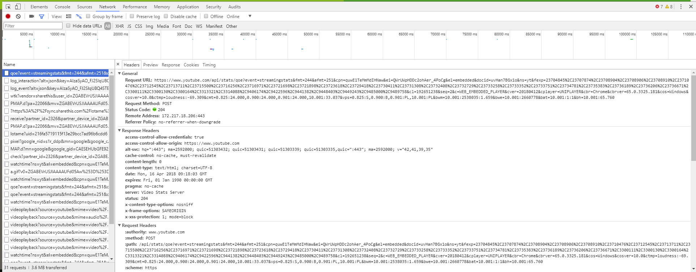

# Architecture WEB

## Présentation
Présentation du support [sur l'architecture web](reveal_architecture_web/index.html).

Consultez la ressource suivante :
[lien Youtube: Le protocole HTTP](https://www.youtube.com/watch?v=k7LcCCApjTg)

Cette présentation doit vous permettre de comprendre le fonctionnement du WEB et de positionner les différents langages.

## Les requêtes HTTP

Le web fonctionne sur une architecture dite __client-serveur__ : un ordinateur A, appelé __le client__, envoie une demande à un ordinateur B, appelé __le serveur__, qui lui adresse en retour une réponse.

Concrètement, un navigateur web (Internet Explorer/Edge, Chrome, Firefox, Safari etc.) envoie une requête HTTP (Hypertext Transfer Protocol) à un serveur d'hébergement de sites dont il reçoit la réponse. 

HTTP est un protocole de communication entre serveurs. Il s'agit d'une couche réseau du niveau applicatif. Les serveurs doivent être équipés de logiciels HTTP (ou HTTPd, un démon sous Linux) : le plus connu est Apache (55% des serveurs) mais il en existe beaucoup d'autres (IIS, Nginx, Tomcat, Lighthttpd, Nodejs etc.) en fonction des langages serveur utilisés.        
 
Il existe 8 types de requêtes HTTP (GET, POST, DELETE etc.). La réponse est elle constituée d'un header, d'un code indiquant le statut de la demande (Exemples les plus connus : 200 = succès, 404 = page web non trouvée) et surtout d'un "corps" ("body") qui comprend tout le code HTML à afficher.  

> Ces explications sont simplifiées, la réalité est plus complexe : plusieurs protocoles (TCP/IP, URL, DNS etc.) interviennent dans le processus d'une requête HTTP, une requête n'est pas forcément envoyée par un navigateur (peut l'être par d'autres logiciels), la machine destinataire n'est pas toujours un serveur unique mais souvent un ensemble de machines etc.

## Observer une requête HTTP

Dans un navigateur (Firefox ou Chrome), faire <kbd>F12</kbd> afin d'afficher le panneau des outils de développement. Cliquer sur "Network" puis cliquer sur une des URLs à gauche et recharger la page pour observer ce qu'il se passe :

     

## Ressources
* [Listes des codes HTTP](https://fr.wikipedia.org/wiki/Liste_des_codes_HTTP "Listes des codes HTTP") 
* [MDN](https://developer.mozilla.org/fr/docs/HTTP/Aper%C3%A7u "MDN")  
* [Statistiques Internet 2018](https://blog-fr.orson.io/100-statistiques-sites-internet-2018)

  