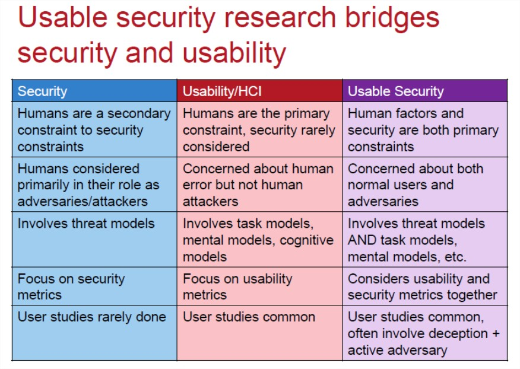

# Sécuriser l'interface utilisateur

> Demander [une présentation](securite.html) en salle à un formateur.

Cette séance sur la sécurisation des interfaces utilisateur suit l'objectif du projet [CyberEdu](https://www.ssi.gouv.fr/particulier/formations/cyberedu) : appliquer la démarche sécurité à toutes les étapes d'un projet informatique. 

La conception de la maquette qui précède le développement de l'interface n'est pas neutre du point de vue de la sécurité. Les principes de sécurisation vus dans cette séance seront appliqués dans la séance suivante _Construire une maquette ergonomique_. 

# L'approche sécurité dans l'ergonomie

## Adapter son interface utilisateur aux exigences de sécurité identifiées.

Une ergonomie sécurisée doit traduire les exigences de sécurité identifiées dans la phase d'analyse. Ces exigences ne seront pas toujours explicites et il faudra souvent refaire des entretiens client avec une approche sécurité, en se posant des questions du type : 

* quel est le niveau de sécurité requis pour l'application, en fonction de son environnement technique et de son domaine professionnel : bancaire, installation industrielle critique, application pour l'utilisateur final, jeu etc. ?
* l'application est-elle multi-utilisateur avec des autorisations et des privilèges sélectifs selon les utilisateurs ?
* l'application est-elle accessible physiquement depuis un environnement protégé ou dans un lieu public ?

## Appliquer les principes généraux de la sécurisation d'interface utilisateur

De même que les règles de sécurité du [CERT](https://www.ssi.gouv.fr/agence/cybersecurite/ssi-en-france/les-cert-francais) rejoignent souvent les bonnes pratiques objet, l'application aux interfaces utilisateur des principes du développement sécurisé va rejoindre les préoccupations de l'ergonomie.

### Le principe de minimalité ou K.I.S.S.

> _Keep it simple, stupid_ est la version la plus commune pour K.I.S.S. mais il en existe [plusieurs versions](https://fr.wikipedia.org/wiki/Principe_KISS).

Rappelons qu'il n'y a jamais de « sécurité par l'obscurité ». Un logiciel difficile à utiliser décourage l'utilisateur de bonne foi, pas l'attaquant.

Une interface utilisateur sera d'autant plus facile à sécuriser qu'elle sera simple, fonctionnelle, facile d'accès pour l'utilisateur. Il faut donc : 

1. éviter la complexité inutile et le design agressif; l'ergonomie n'est pas synonyme de tape à l'œil ;

2. quel problème précis essaie-t-on de résoudre dans l'application ? 

Une application cohérente répondant complètement à un problème bien défini, sera plus facile à sécuriser qu'une grosse application qui veut tout faire et le fait mal. Il sera évidemment plus facile de rechercher les vulnérabilités, les menaces et les attaques possibles, en connaissant précisément l'objectif de l'application, son périmètre, ses utilisateurs. Il ne faut donc pas hésiter à découper une application complexe enplusieurs petites applications ciblées et fonctionnelles.

3. La cohérence exigée pour l'application l'est aussi pour ses différents éléments graphiques : chaque élément doit fournir une fonctionnalité bien délimitée et n'être accessible qu'à l'utilisateur ou au groupe d'utilisateurs autorisé.

### Adopter une posture de méfiance

Nous avons vu dans la séance précédente qu'une couche logicielle, même interne, ne doit jamais accorder une confiance totale aux autres couches, et qu'elle doit donc valider systématiquement ses entrées. 

Ce principe s'applique en premier lieu à l'interface utilisateur qui est une couche externe, directement exposée aux attaques. Pour reprendre la comparaison classique avec l'architecture militaire, l'interface utilisateur est le premier niveau de défense du château (fossés) qui devrait suffire à empêcher les attaques basiques. 
 
Il faut se méfier à la fois de ce qui vient de l'extérieur (sécurisation des entrées) et de ce qu'un attaquant pourrait faire avec les informations qu'on lui renvoie (contrôle des sorties) : 

**Sécuriser ses entrées**

* pour minimiser les attaques, il vaut mieux prévenir les erreurs qu'y répondre après coup. Il faut éviter autant que possible de solliciter le code de contrôle de l'interface utilisateur (deuxième niveau de défense, le rempart extérieur) lorsque de bons choix d'ergonomie suffisent à empêcher l'erreur : éviter par exemple de saisir une date dans un champ texte, en confiant au code la vérification de la chaine saisie ;
 * on choisira donc des composants graphiques spécialisés pour les entrées dont le type et l'intervalle sont connus à l'avance : valeurs entières ou réelles, dates, énumérations etc. On privilégiera les champs de saisie typés avec masque, les calendriers, les listes, les cases à cocher, les boutons radios ou tout composant graphique avec une question fermée, à un champ de saisie simple ;
 * pour les données où aucun composant graphique spécialisé n'est disponible, on vérifiera la cohérence de la saisie dès que l'utilisateur quitte le champ. Cela facilite la vie de l'utilisateur qui n'accumule pas les erreurs de saisie, et évite aussi les effets de bord qui peuvent créer des vulnérabilités : par exemple, un champ « mesure » a un intervalle de validité différent selon le choix effectué dans le champ « unité » ; comment réagira l'application si le champ « unité » n'est pas saisi ou est s'il est incorrect ?
 * on fera une nouvelle validation de toutes les entrées, par code, avant d'effectuer le traitement métier demandé (par exemple, à la validation du formulaire dans le cas du web). On vérifiera que tous les champs obligatoires ont bien été saisis, et que les champs saisis ont des valeurs correctes

**Contrôler ses sorties** 

On n'est pas tenté d'attaquer ce que l'on ne voit pas : dans le château-fort, l'assaillant voit le rempart extérieur, mais pas le trésor dans le donjon; les positions des sentinelles et les heures de relève ne sont pas affichées à l'entrée !

Pour bien sécuriser une interface utilisateur, il faut penser aux conséquences des informations communiquées sur la sécurité de notre application, mais aussi sur celle des autres applications et de l'entreprise elle-même :

**Exposition minimale des données** 

Ne communiquer que les données réellement exigées par les fonctionnalités de l'application (elles-mêmes minimales et exigées par le cahier des charges). Toute fonctionnalité et tout affichage superflu ne sont profitables qu'à l'attaquant.
 
*Exemple*

Un annuaire d'entreprise doit filtrer les informations issues de la DRH (nom, prénom, nom du service, bureau, étage, téléphone) et éviter de communiquer l'âge du salarié ou son salaire.
 
Mais cela peut aller plus loin : dans un environnement fortement sécurisé, l'application n'affichera que les numéros des services et pas leurs noms complets ; car ceux-ci renseignent déjà sur l'activité du service, et peuvent mettre en danger les salariés qui y travaillent.

A partir d'un outil public (l'annuaire, l'affichage sur le rempart), on accède à une donnée confidentielle (la spécialité du salarié, l'emplacement du trésor).
 
**Messages d'information et d'erreur minimaux et neutres** 

« Le diable est dans les détails » : un développeur peut vouloir guider au mieux son utilisateur, auquel il donne sa confiance, sans prendre en compte les cas d'attaques. Il faut guider l'utilisateur, mais en filtrant toutes les informations en sortie, de façon à ce qu'elle ne facilite pas les attaques (la position et l'heure de relève des sentinelles !).

*Exemples* 

* des plantages qui affichent la ligne en défaut, le nom du serveur, l'erreur SQL etc. Solution : désactiver l'affichage des erreurs en production (elles resteront accessibles dans des fichiers de logs sur le serveur pour l'équipe mais pas publiques).  

* des exceptions bien gérées mais qui affichent intégralement l'erreur système, ce qui revient au cas précédent. Dans les deux cas, l'utilisateur malveillant tirera profit de ces messages pour analyser votre architecture système et préparer ses attaques. 

Bonne pratique : il faut néanmoins, sur le plan ergonomique, que l'utilisateur comprenne qu'il y a un problème, utiliser des messages fonctionnels plus génériques comme « utilisateur inexistant » et non pas : 
  	
* des messages d'information fonctionnel mais trop précis : 

Suite à une erreur de connexion, l'application affiche sélectivement « Utilisateur inconnu » ou « Mot de passe incorrect ». Cela facilite la tâche du hacker, qui peut lancer une attaque par « force brute » d'abord uniquement sur le nom de l'utilisateur, puis lorsqu'il est trouvé, sur le mot de passe : [Attaque par force brute](fr.wikipedia.org/wiki/Attaque_par_force_brute).

### Séparer et minimiser les permissions et les privilèges

Puisque l'interface utilisateur est la couche logicielle au contact du monde extérieur, elle doit prendre en compte l'authentification des utilisateurs et le partitionnement de leurs tâches.

Chaque utilisateur ne verra que les données autorisées et n'aura accès qu'aux fonctionnalités qui le concernent.

Encore une fois, on n'est pas tenté par ce que l'on ne voit pas : il ne faut donc pas mettre en grisé ou invalider les fonctionnalités autorisées à d'autres utilisateurs. C'est presque demander à être attaqué ! Les zones visibles et invalidées doivent désigner des fonctionnalités permises à l'utilisateur connecté dans un autre contexte : par exemple, le champ « mesure » est invalide quand le champ « unité » n'a pas encore été saisi, puisque l'unité doit être connue pour valider la cohérence de la mesure saisie.

### Que valent les défenses de l'interface utilisateur ?

* une interface utilisateur est par définition côté client (pour un client lourd) ou accessible du client (pour un client web).
* elle peut donc être cassée : le hacker peut par exemple lire le code JavaScript dans le cas d'un client web (ou, pour un client lourd, décompiler le code) et rendre accessibles les champs et les menus cachés, pour les utilisateurs non identifiés.
* les défenses côté client sont donc en général assez faibles. Certains les considèrent comme un simple confort pour l'utilisateur de bonne foi : une interface bien conçue va le guider et lui éviter d'outrepasser ses droits, en créant des problèmes par inadvertance ; mais elle n'oppose qu'une faible résistance au vrai hacker.
* bien que cette opinion soit fondée, une interface utilisateur sécurisée reste un premier niveau de défense utile, comme le rempart dans le château-fort. Elle n'a jamais eu pour but d'arrêter toutes les attaques, mais de décourager les attaquants peu qualifiés et de retarder les autres. 
* la sécurisation de l'interface utilisateur n'a de sens qu'associée à un système de « défense en profondeur » où chaque couche va adopter une posture de méfiance et tester à nouveau toutes ses entrées : le deuxième niveau de défense côté serveur (le donjon) sera bien sûr plus robuste.

## Concilier l'approche sécurité avec les attentes de l'utilisateur

En se centrant uniquement sur la sécurité, les deux points précédents considèrent tout utilisateur, normal ou hacker, comme un problème et jamais comme une solution.

En se centrant uniquement sur la sécurité, les deux points précédents considèrent tout utilisateur, normal ou hacker, comme un problème et jamais comme une solution. Mais les études récentes dans le domaine des interfaces utilisateur concluent qu'une approche sécurité ne peut réussir que si elle respecte l'utilisateur normal, en prenant en compte ses demandes, son vocabulaire, son mode de travail et de pensée, afin de l'amener à participer activement à la sécurité de l'entreprise.

#### Lire l'exposé [UI\_vs\_Security.pdf](docs_stagiaires/UIvsSecurity.pdf) en suivant ce Guide de lecture

**pages 1-4** : il ne sert à rien de considérer l'utilisateur comme la source de tous les maux. 
 
Le problème n'est pas l'utilisateur, mais le contexte dans lequel il va travailler. Nous ne pourrons jamais contrôler l'utilisateur, mais nous pouvons contrôler le contexte dans lequel il travaille, via l'interface utilisateur.

**pages 7-8** : l'exemple des mots de passe montre qu'il peut y avoir contradiction entre les exigences de la sécurité informatique, et les capacités humaines.

Un utilisateur aura tendance à choisir des mots de passe simples pour pouvoir les mémoriser. Des exigences draconiennes sur la longueur et la complexité des mots de passe peuvent être contre-productives : l'utilisateur finira par écrire son mot de passe sur un Post-It collé sur son écran ! En réalité, ce n'est pas le mot de passe qui est faible, mais le système d'identification par mot de passe qui montre son insuffisance.

Pour une sécurité accrue, il faut passer par d'autres systèmes d'identification, carte, reconnaissance biométrique : [http://www.biometrie-online.net](http://www.biometrie-online.net).

**pages 9-11** : l'interface utilisateur ne doit pas se décharger de sa responsabilité sur l'utilisateur, en multipliant les boîtes de dialogue de confirmation, avec des formulations souvent confuses, qui interrompent le déroulement normal du travail de l'utilisateur.

Les choix présentés à l'utilisateur devraient parler d'eux-mêmes et il faudrait réserver les boîtes de dialogue et les messages pour des cas d'erreurs ou des choix risqués.

**pages 11-13** : une interface utilisateur mal conçue et peu lisible a souvent une part de responsabilité dans les attaques par « ingénierie sociale » comme le hameçonnage (fishing).

Dans l'exemple, le formulaire web contient de nombreuses incohérences, mais elles sont masquées par la présentation.

**pages 14-16** : toutes les interfaces utilisateur graphiques reposent sur des « métaphores » : un répertoire est représenté par un dossier, une clé de cryptographie par une clé réelle etc. Les métaphores sont pratiques et facilitent la compréhension et l'utilisation du logiciel. Mais elles sont souvent utilisées sans précaution, alors qu'elles peuvent être porteuses de significations fausses ou involontaires.

Le courriel est un exemple particulièrement mauvais de métaphore : un « message » est un « document » contenant des « données » ; message et données paraissent sans danger. Mais en réalité, un courriel peut aussi transporter du code dangereux, en pièce jointe.

**pages 22-23** : Conclusion
 
* Le problème n'est pas chez les utilisateurs, mais dans l'interface utilisateur.
* La conception d'une bonne interface utilisateur doit affecter une responsabilité à celui auquel elle revient, ne se fait pas remarquer (pas « tape à l'œil »), parle le langage de son destinataire et n'espère pas obtenir un comportement non humain de la part des humains.
* La prise en compte des facteurs humains va améliorer la sécurité en entraînant une meilleure acceptation du logiciel et en réduisant les erreurs.
* Respecter l'utilisateur et ses besoins permettra d'obtenir une bonne coopération.

**pages 24** Les principes : 

* **Profilage des utilisateurs**: connais ton utilisateur, parle son langage
* **La métaphore** : emprunte des comportements à des contextes familiers pour les utilisateurs
* **Visibilité** : laisse l'utilisateur voir clairement ses options
* **Cohérence**: le comportement (de l'application) devrait être cohérent (constant)
* **Contexte et gestion des processus métier (workflow)** : adapte-toi au mode (à l'état) dans lequel l'utilisateur est actuellement.
* **Test par les utilisateurs** : demande de l'aide pour repérer les problèmes inévitables

Le tableau qui suit résume clairement les objectifs propres de la sécurité informatique, de la conception d'interface utilisateurs (HCI = Human-Computer interaction) et de leur synthèse indispensable (Usable Security) :

* Il faut prendre en compte à la fois, comme des contraintes fondamentales, les facteurs humains et la sécurité ;
* Il faut s'intéresser autant aux utilisateurs normaux qu'aux adversaires et aux attaquants potentiels ;
* Il faut inclure à la fois des modèles de menaces, des modèles métier et des modèles cognitifs ;
* Pour rendre compte de la performance de l'interface utilisateur, il faut mesurer à la fois la facilité d'utilisation (usability) et la sécurité de l'application ;
- Il faut faire un double retour d'expérience utilisateur : sur l'utilisation courante, mais aussi sur les adversaires actifs et les cas d'attaque.

## Comment procéder dans un projet ?

Ces trois contraintes sont indissociables : pendant toute la conception de l'interface utilisateur, il  faut  concilier  les  principes  généraux de sécurisation, les exigences de sécurité propres à l'application et la prise en compte des demandes utilisateur en tant que telles.

Les exigences de sécurité peuvent être listées avant la construction de la maquette mais elles devront être  affinées de façon itérative en cours de construction, en particulier dans un projet piloté en méthode  agile, où la conception graphique de la maquette se fait en étroite collaboration avec le client.

L'approche sécurité participe à la qualité de la conception et à l'activité de conseil vis-à-vis du client, en lui faisant prendre conscience des conséquences de ses choix de présentation sur la sécurité de son application : vulnérabilités issues de choix marketing, ludiques, tape à l'œil etc.

Il est clair que l'interface utilisateur est un argument de vente pour certains types d'application, dont la présentation ne pourra être conduite seulement par des critères de sécurité. Comme on vient de le voir, négliger les attentes et les besoins de l'utilisateur va même à l'encontre d'une sécurité efficace.

Mais à l'inverse, une approche sécurité doit au minimum évaluer les risques encourus dans chaque choix, et le faire savoir au client.

## Quid du développeur dans la conception d'interface utilisateur sécurisée ?

L'ergonomie et la sécurisation des interfaces utilisateurs est un métier à part entière.

Comme dans les séances qui suivront sur le réseau et la cryptographie, l'objectif fixé par le projet **CyberEdu** n'est pas de former des spécialistes, mais de sensibiliser tous les développeurs informatiques à des activités proches et transverses, qui ont un impact direct sur la sécurité globale de leur application. Mais ceci n'interdit pas à des développeurs motivés par ce domaine de se perfectionner.

Nous  suivrons  donc  la  même  démarche  que  dans  la  séance  « Coder  de  façon  défensive  en  suivant les bonnes pratiques de sécurité » :

* Acquisition des réflexes de base du développement d'interface sécurisée, à partir d'une étude de cas ;
* Présentation  de  sites  et  de  guides  d'éditeur  (Apple,  Microsoft)  sur  la  sécurisation  des  interfaces utilisateur, pour aller plus loin.

## Mise en pratique

Pour illustrer les principes de la sécurisation d'interface utilisateur, nous allons partir du cahier des  charges  du site pour se poser les questions importantes sur la sécurité et justifier ses choix.

Vous mettrez vous-même en pratique cette démarche dans la séance suivante _Construire la maquette de l'application_.  

## Cahier des Charges

[Cahier des charges Jarditou](CDC.html)

    