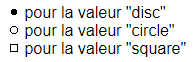
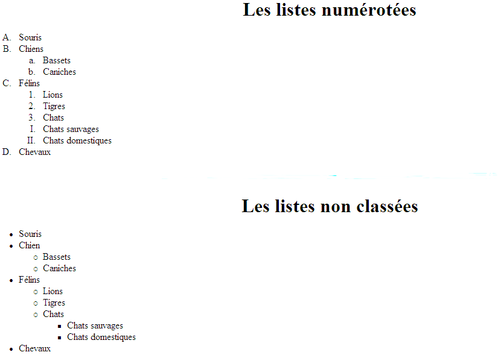

# HTML - 05 - Listes 

En HTML, une liste est un ensemble de points (alinéas).

Les listes peuvent être :

* non ordonnées : précédées d'un signe graphique (cercle, carré...). 
* ordonnées : précédées de chiffres ou de lettres. 

L'utilisation première des listes HTML est la construction des menus de navigation. 

Par défaut les listes sont affichées verticalement mais elles peuvent l'être de façon horizontale grâce à l'usage des feuilles de style CSS (permet d'habiller les listes de façon beaucoup plus poussée).    

## Liste non ordonnée 

Les listes non ordonnées sont déclarées par la balise `<ul>` (_Unordered List_). 

Cette balise permet de définir une liste dans laquelle chaque élément est précédé d'une puce. 

Chaque élément de la liste sera repéré par la balise `<li>`. 

_Exemple_ 

	<ul> 
	   <li>TB</li> 
	   <li>DWWM</li>
	   <li>CDA</li>
	</ul>

_Résultat_ : 

<ul> 
      <li>TB</li> 
	  <li>DWWM</li>
	  <li>CDA</li>
</ul>

### Les puces

Les items des listes non ordonnées sont précédés d'un signe graphique appelé _puce_. Par défaut, un disque (cercle) plein sera affiché. 

Il existe différentes formes de puces (carré, cercle, plein ou vide), le choix se gère avec le langage CSS.  

## Liste ordonnée 

Les listes ordonnées s'obtiennent avec la balise `<ol>` (_Ordered List_). 

Une incrémentation apparaît automatiquement, par défaut avec des numéros.

Chaque élément de la liste sera repéré par la balise `<li>`.

_Exemple :_ 

	<ol> 
	   <li>TB</li> 
	   <li>DWWM</li>
	   <li>CDA</li>
	</ol>

_Résultat_ : 

<ol> 
    <li>TB</li> 
	<li>DWWM</li>
	<li>CDA</li>
</ol>

_Exemple avec les chiffres romains:_ 

    <ol type="i">
       <li>toto</li>
       <li>truc</li>
       <li>bidule</li>
    </ol>

_Résultat_ : 

<ol type="i">
  <li>toto</li>
  <li>truc</li>
  <li>bidule</li>
</ol>

## Style de forme et de numérotation

## Alignement

Par défaut, les listes sont affichées en mode vertical. Le langage CSS permet de changer pour un affichage horizontal.   
 
## Exercice

Réalisez les exemples ci-dessous dans une nouvelle page HTML :

