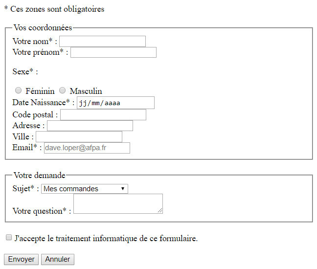

# HTML - 08 - Formulaires

Les formulaires permettent à l'internaute d'effectuer une saisie et d'envoyer les informations saisies vers le serveur web afin d'y être traitées par un langage côté serveur. 

Les saisies dans un formulaire peuvent s'effectuer par : 

* des champs de saisie de texte, 
* des zones de texte multilignes, 
* des listes de choix (listes déroulantes), 
* des cases à cocher (checkbox) pour des choix multiples de réponses,
* des boutons radio, pour un choix unique de réponse,
* il est aussi possible de télécharger un fichier 

## Structure d'un formulaire
 
### Déclaration d'un formulaire 

Un formulaire s'ouvre avec la balise `<form>` et se termine par `</form>` :

**Exemple :**  

	<form>
    
	</form>

La balise `<form>` possède obligatoirement l'attribut `action`. D'autres attributs sont facultatifs.
 
	<form action="destination.php" method="post" id="formulaire_contact"> 
    
	</form>

**Explications :**

<table>
<thead>
<tr>
	<th>Attribut</th>
	<th>Utilité</th>
</tr>
</thead>
<tbody>
<tr>
<td>action</td>
<td>Indique le nom (chemin/url) du fichier qui sera exécuté lors de l'envoi du formulaire. 
 
Ce fichier de destination recevra et traitera les données : contrôles des informations saisies, enregistrement en base de données... Ce fichier sera écrit dans un langage côté serveur (PHP, ASP...).
</td>
</tr>
<tr>
<td>method</td>
<td>L'attribut `method` est facultatif. Il peut recevoir 2 valeurs : 
 
* `GET` : les données saisies sont ajoutées à l'url. Lorsque l'attribut `method` est absent (puisque facultatif), la valeur par défaut est `GET`. L'utilisation de cette valeur est à éviter pour des questions de sécurité. 
 
* `POST` : les données saisies dans le formulaire n'apparaissent pas dans l'url. <strong>L'utilisation de cette valeur est recommandée.</strong>   
</td>
</tr> 
<tr>
<td>`accept`</td>
<td>Permet de n'autoriser que certains types (MIME) de fichiers (ne constitue en rien une sécurité).</td>
</tr> 
</tbody>
</table>

### Champs de saisie

A l'intérieur de la balise `<form>`, on place tout le code permettant la saisie de données : champs textes (balises `<input>`, listes déroulantes... cf. plus loin dans ce cours). 

**Exemple :**  

	<form action="destination.php" method="post"> 
	   <input type="text" name="nom"> 
       <input type="text" name="prenom"> 
	</form>

Ces balises font appraître les zones dans lesquelles l'internaute pourra saisir du texte/effectuer des choix. 

Il existe plusieurs types de champs, cf. plus loin dans ce cours.

### Soumission du formulaire
 
Pour envoyer - on dit aussi soumettre ou poster - un formulaire, il faut en dernier (c'est-à-dire avant la balise de fermeture `</form>` un champ spécifique dont le type possède la valeur `submit` :  

**Exemple :**  

	<form action="destination.php" method="post"> 
	   <input type="text" name="nom"> 
       <input type="text" name="prenom"> 
	   <input type="submit" value="Envoyer"> 
	</form>
 
> Ce type de champ peut être remplacé par un bouton avec un attribut type qui a la valeur `submit`: `<button type="submit">Envoyer</submit>`.

## Les types de champs 

### Champs de saisie de texte

L'internaute peut saisir une information dans un champ de saisie par l'intermédiaire de la balise `<input type="text">`.  

**Exemple :**    
   
	`Nom : <input type="text" name="nom">`

Affiche :

Nom : <input type="text" name="nom">

> En HTML 5, la balise `<input>` ne nécessite pas de slash de fermeture : `<input type="text"...>` et non `<input type="text" />`.   

La balise `<input>` possède les attributs principaux suivants : seuls les attributs `type` et `name` sont obligatoires. **Si l'attribut name est manquant pour un champ, les données saisies dans ce champ ne seront pas transmises au fichier de destination**. 

<table>
	<thead>
		<tr>
			<th>Attribut</th>
	        <th>Caractère</th>
            <th>Utilité</th>
		</tr>
	</thead>
    <tbody>
    <tr>
    <td>`type`</td>
    <td>Obligatoire</td>
    <td>Le type de champ. Les valeurs possibles (text, radio...) pour cet attribut sont évoquées ci-après.</td>
    </tr>
    <tr>
    <td>`name`</td>
    <td>Obligatoire</td>
    <td>Nom de la donnée. C’est le nom sous lequel l’information saisie ici sera connue et récupérée dans le script serveur déclenché par le formulaire.</td>
    </tr> 
    <tr>
    <td>`value`</td>
    <td>Facultatif</td>
    <td>Texte définit comme valeur par défaut.</td>
    </tr> 
    <tr>
    <td>`size`</td>
    <td>Facultatif</td>
    <td>Permet de définir un nombre de caractère visible pour le champ.</td>
    </tr> 
    <tr>
    <td>`maxlength`</td>
    <td>Facultatif</td>
    <td>Permet de définir un nombre de caractère maximum saisissable.</td>
    </tr> 
    <tr>
    <td>`autocomplete`</td>
    <td>Facultatif</td>
    <td>Active l'autocomplétion du champ (par rapport aux saisies effectuées précédem-ment dans le navigateur (cache) pour le même champ. Cet attribut peut recevoir de [nombreuses valeurs](https://developer.mozilla.org/fr/docs/Web/HTML/Attributs/autocomplete#Valeurs)</td>
    </tr> 
    <td>`autofocus`</td>
    <td>Facultatif</td>
    <td>Donne la priorité (focus) au champ lors du chargement du formulaire (c’est-à-dire que le curseur sera positionné directement dans le champ).</td>
    </tr> 
    <tr>
    <td>`readonly`</td>
    <td>Facultatif</td>
    <td>Met le champ en lecture seule, aucune saisie ne sera possible..</td>
    </tr> 
     <tr>
    <td>`disabled`</td>
    <td>Facultatif</td>
    <td>Désactive le champ, aucune interaction possible (ni saisie ni évènements).</td>
    </tr>
      <tr>
    <td>`placeholder`</td>
    <td>Facultatif</td>
    <td>affiche (grisé) un texte d'indication qui s'effacera lors de la saisie du premier caractère.</td>
    </tr>  
    </tbody>
</table>

**Exemple avec les différents attributs :**    

`Nom : <input type="text" name="nom" size="50" maxlength="50" value="Dave LOPER">`
	
Affiche :

Nom : <input type="text" name="nom" size="50" maxlength="50" value="Dave LOPER">

Ici, _Dave LOPER_ s'affiche par défaut dans le champ car cette valeur est prérenseignée dans l'attribut `value`. 

> Il existe de nombreux [autres attributs](https://www.w3schools.com/tags/tag_input.asp) applicables à la balise `<input>` mais il convient de s'assurer de leur compatibilité avec les navigateurs.

## Zones de saisie multi-lignes

Lorsque l'on veut saisir du texte sur plusieurs lignes ou un texte long, on passe par des zones de saisie multilignes à l'aide de la balise `<textarea>...</textarea>`. 

Cette balise possède les attributs suivants :

<table>
	<thead>
		<tr>
			<th>Attribut</th>
             <th>Caractère</th>
			<th>Utilité</th>
		</tr>
	</thead>
    <tbody>
    <tr>
    <td>`name`</td>
    <td>Obligatoire</td>
    <td>Nom de la donnée. C’est le nom sous lequel l’information saisie ici sera connue et récupérée dans le script serveur déclenché par le formulaire.</td>
    </tr>
    <tr>
    <td>`rows`</td>
     <td>Facultatif</td>
    <td>Nombre de lignes dans la zone de saisie.</td>
    </tr> 
    <tr>
    <td>`cols`</td>
     <td>Facultatif</td>
    <td>Nombre de caractères par ligne dans la zone de saisie.</td>
    </tr> 
    </tbody>
</table>

La valeur par défaut contenue dans la zone de saisie multi-ligne est le texte compris entre les balises `<textarea>` et `</textarea>`. 

Exemple d'une zone de saisie multi-lignes :   
 
	`<textarea name="commentaire" rows="10" cols="50">Lorem ipsum dolor sit amet, consectetur adipiscing elit. Donec sagittis quis metus ornare semper. In vitae lacus ex. In elementum iaculis malesuada. Maecenas vulputate, erat id molestie dictum, diam dolor faucibus nisl, in pharetra sapien libero eget risus. Morbi vehicula aliquam placerat. Suspendisse mollis tempus dictum. Nullam suscipit nec massa eget viverra. Etiam feugiat facilisis est nec euismod. Quisque convallis, tortor sed placerat lacinia, elit nunc volutpat arcu, vel consequat velit libero at tortor. Suspendisse interdum lacus non felis bibendum facilisis. In sit amet enim mauris.</textarea>`

Affiche :

<textarea name="commentaire" rows="10" cols="50">Lorem ipsum dolor sit amet, consectetur adipiscing elit. Donec sagittis quis metus ornare semper. In vitae lacus ex. In elementum iaculis malesuada. Maecenas vulputate, erat id molestie dictum, diam dolor faucibus nisl, in pharetra sapien libero eget risus. Morbi vehicula aliquam placerat. Suspendisse mollis tempus dictum. Nullam suscipit nec massa eget viverra. Etiam feugiat facilisis est nec euismod. Quisque convallis, tortor sed placerat lacinia, elit nunc volutpat arcu, vel consequat velit libero at tortor. Suspendisse interdum lacus non felis bibendum facilisis. In sit amet enim mauris.</textarea>

> Notez l'appariton éventuelle d'ascenseurs verticaux et/ou horizontaux quand le nombre de colonnes/lignes s'avère insuffisant. 

## Cases à cocher et boutons radio

Les données peuvent être sélectionnées par l'internaute dans des cases à cocher (plusieurs choix), ou dans des boutons radio (choix unique). Pour cela, on utilise les balises suivantes : 
 
* `<input type="checkbox"`, pour les cases à cocher, 
* `<input type="radio"`, pour les boutons radio. 

Ces balises possèdent les attributs suivants :

<table>
	<thead>
		<tr>
			<th>Attribut</th>
            <th>Caractère</th>
            <th>Utilité</th>
		</tr>
	</thead>
    <tbody>
    <tr>
    <td>`name`</td>
    <td>Obligatoire</td>
    <td>Nom de la donnée. C'est le nom sous lequel l'information saisie ici sera connue et récupérée dans le script serveur déclenché par le formulaire.</td>
    </tr>
    <tr>
    <td>`value`</td>
    <td>Obligatoire</td>
    <td>Libellé correspondant à l'option choisie.</td>
    </tr> 
    <tr>
    <td>`checked`</td>
    <td>Facultatif</td>
    <td>Indique que l'option sera sélectionnée par défaut.</td>
    </tr> 
    </tbody>
</table>

**Exemple de cases à cocher :**   
  
	<input type="checkbox" name="couleur1" value="Bleu" checked> Bleu 
	<input type="checkbox" name="couleur2" value="Rouge"> Rouge 
	<input type="checkbox" name="couleur3" value="Vert" > Vert

Affiche :

<input type="checkbox" name="couleur1" value="Bleu" checked> Bleu 
<input type="checkbox" name="couleur2" value="Rouge"> Rouge 
<input type="checkbox" name="couleur3" value="Vert"> Vert

> Ici, _Bleu_ est coché par défaut grâce à l'attribut `checked`.

**Exemple de boutons radio :**
  
	<input type="radio" name="couleur" value="Bleu"> Bleu 
	<input type="radio" name="couleur" value="Rouge"> Rouge 
	<input type="radio" name="couleur" value="Vert" checked> Vert

Affiche :

<input type="radio" name="couleur" value="Bleu"> Bleu 
<input type="radio" name="couleur" value="Rouge"> Rouge 
<input type="radio" name="couleur" value="Vert" checked> Vert

**Les boutons radio doivent avoir le même nom, c'est-à-dire la même valeur pour l'attribut `name`.**.

## Liste de choix (déroulantes)

L'internaute peut sélectionner les informations qu'il désire dans une liste pré-renseignée. 

La balise `<select>` permet de définir la liste des choix possibles. 

Chaque choix sera défini par une balise `<option>`, incluse dans le `<select>`. 

**Exemple :**  
   
	<select name="couleur"> 
	    <option>Bleu</option>
	    <option>Rouge</option>
	    <option>Vert</option>
	</select>   

Les attributs possibles de la balise `<select>` sont les suivants :

<table>
	<thead>
		<tr>
			<th>Attribut</th>
            <th>Obligatoire</th>
			<th>Utilité</th>
		</tr>
	</thead>
    <tbody>
    <tr>
    <td>`name`</td>
    <td>Obligatoire</td>
    <td>Nom de la donnée. C'est le nom sous lequel l'information saisie ici sera connue et récupérée dans le script serveur déclenché par le formulaire.</td>
    </tr>
    <tr>
    <td>`size`</td>
    <td>Obligatoire</td>
    <td>Si size vaut 1 (valeur par défaut), c'est une liste déroulante (un seul choix possible). 
    Si size > 1, c'est une liste de choix avec ascenseur.</td>
    </tr> 
    <tr>
    <td>`multiple`</td>
    <td>Indique que la sélection pourra être multiple (valable également sur les champs `input` de types `email` et `file`).</td>
    </tr> 
    </tbody>
</table>

Les attributs possibles de la balise `<option>` sont les suivants :

<table>
	<thead>
		<tr>
			<th>Attribut</th>
            <th>Caractère</th>
			<th>Utilité</th>
		</tr>
	</thead>
    <tbody>
    <tr>
    <td>`value`</td>
    <td>Facultatif</td>
    <td>Nom de la donnée pour l'option correspondante. Permet de spécifier une valeur différente de celle affichée à l'internaute. Si absent (attribut facultatif), c'est la valeur affichée à l'internaute (entre <option> et </option>) qui es transmise.</td>
    </tr>
    <tr>
    <td>`selected`</td>
    <td>Obligatoire</td>
    <td>Détermine le choix par défaut.</td>
    </tr> 
    </tbody>
</table>

** Exemple de liste de choix avec l'attribut `selected` :**   
   
	<select name="couleur"> 
	    <option value="Bleu">Bleu</option>
	    <option value="Rouge">Rouge</option>
	    <option value="Vert" selected>Vert</option>
	</select>

Ici, si l'internaute ne choisit rien, _Vert_ sera retenu par défaut. 

** Exemple de liste de choix avec l'attribut `size` (valeur = 3) :**   
   
	<select name="couleur" size="3"> 
	    <option value="Bleu">Bleu</option>
	    <option value="Rouge">Rouge</option>
	    <option value="Vert">Vert</option>
        <option value="Jaune">Jaune</option>
        <option value="Blanc">Blanc</option>
	</select>

Affiche :

<select name="couleur" size="3"> 
    <option value="Bleu">Bleu</option>
    <option value="Rouge">Rouge</option>
    <option value="Vert">Vert</option>
    <option value="Jaune">Jaune</option>
    <option value="Blanc">Blanc</option>
</select>

## Chargement de fichiers 
 
Le type `file` sur une balise `<input>` permet le téléchargement d'un fichier du PC de l'utilisateur sur le serveur où est hébergée la page web.   

L'utilisation de ce type requiert impérativement d'ajouter à la balise `<form>` :

* La valeur `POST` pour l'attribut `method`, car le téléchargement de fichier ne fonctionne pas avec une requête HTTP GET).
* L'attribut `enctype` avec la valeur _multipart/form-data_.

**Exemple :**

	<form action="destination.php" method="post" enctype="multipart/form-data"> 
	<input type="file" name="fichier"> 

Affiche :

<form action="destination.php" method="post" enctype="multipart/form-data"> 
<input type="file" name="fichier">
  
Le fichier sera alors stocké physiquement sur le serveur dans un répertoire dont le chemin sera à définir dans le traitement (langage côté serveur). 

**Le téléchargement d'un fichier sur un serveur via un formulaire présente des failles de sécurité  graves qu'il convient de traiter avec un langage côté serveur.**

**Exemple :**  

	<input type="file" name="fichier" accept="image/png">` n'autorisera que les images de type png.
  
<table>
	<thead>
		<tr>
			<th>Attribut</th>
			<th>Utilité</th>
		</tr>
	</thead>
    <tbody>
    <tr>
    <td>`multiple`</td>
    <td>Sélection multiple de fichiers.</td>
    </tr>
    <tr>
    <td>`required`</td>
    <td>Champ requis (encore une fois, ne valide en rien à la sécurité).</td>
    </tr> 
     <tr>
    <td>`accept`</td>
    <td>Permet de n'autoriser que certains types (MIME) de fichiers (ne constitue en rien une sécurité).</td>
    </tr> 
    </tbody>
</table>

Différentes informations sur le fichier (nom, taille, type MIME etc.) seront transmises par la page web au serveur. Ces informations seront à récupérer, contrôler et traiter via un langage de script côté serveur (PHP...).

## Champs cachés

Il est possible d'envoyer des données cachées au serveur (données non saisies par l'utilisateur mais créées dans le code HTML du formulaire). Ceci se fait en affectant la valeur `hidden` à l'attribut `type` :

	`<input type="hidden"...>`

> L'attribut `hidden` **ne sécurise en rien** un formulaire. En affichant le code source, la valeur saisie est visible en clair.
 
## Etiquette de champs

Pour indiquer à l'internaute quelle est l'information à saisir dans le champ, il faut ajouter une étiquette de champ via la balise `<label>` :

	<label for="nom">Nom :</label><input type="text" name="nom" id="nom"> 

La balise `<label>` possède obligatoirement l'attribut `for` qui permet d'associer l'étiquette au champ de formulaire souhaité. 

Du côté du champ (balise `<input>`), il est nécessaire d'ajouter l'attribut `id` dont la valeur doit correspondre avec celle du `for` pour que l'association fonctionne.

> En pratique, on renseigne les attributs `id` et `for` avec la même valeur que l'attribut `name`, sauf pour les champs de types cases à cocher et bouton radio.

## Groupes de champs
 
La balise `<fieldset>` permet de constituer des groupes de champs. Son utilisation nécessite obligatoirement la balise fille `<legend>`, à placer immédiatement après, qui attribue un nom au groupe.

**Exemple :**

`<fieldset>
 <legend>Coordonnées</legend>
 Nom: <input type="text" name="nom"> 
 Email: <input type="email" name="email"> 
 Date de naissance: <input type="date" name="ddn">
 </fieldset>`

Affiche :

<!--
<fieldset>
 <legend>Coordonnées</legend>
 Nom: <input type="text" name="nom"> 
 Email: <input type="email" name="email"> 
 Date de naissance: <input type="date" name="ddn">
 </fieldset>
-->

## Autres types de champs 

### Datalist

HTML5 a ajouté l'élément `<datalist>` qui permet de cibler une liste d'éléments via un champ `<input>`. Une autocomplétion/autosuggestion sera faite à l'internaute en fonction des caractères qu'il saisit si une ou des valeur(s) présentes dans les `<option>` correspondent.

**Exemple :**

	<label for="metiers2">Sélectionnez votre métier</label>
	<input type="text" name="metiers1" id="metiers2" list="metiers3">
    <datalist id="metiers3">
		<option value="webmaster">
		<option value="développeur">
		<option value="administrateur B.D.D.">
        <option value="webdesigner">
	</datalist>

* Dans la balise `<input>`, on ajoute l'attribut `list` qui reçoit pour valeur l'identifiant de la balise `<datalist>`, ils sont ainsi associés.
* Dans la balise `<datalist>`, il faut donc l'attribut `id` avec une valeur identique à celle de l'attribut `list`.
* Les différents choix sont indiqués via des balises `<option>` avec un attribut `value` (comme pour la balise `<select>`).  

<!-- +++ EN COMMENTAIRES ++++++++++++++++++
### Output

La balise `<output>` (= sortie) permet l'affichage du résultat d'un calcul lors de la soumission d'un formulaire grâce à l'instruction HTML d'événement `onsubmit`.  

**Exemple :**

	<form method="post" action="post.php" id="monform" onsubmit="resultat.value = parseInt(nombre1.value) + parseInt(nombre2.value); return false;">
	  <input type="number" name="nombre1" id="nombre1"> + <input type="number" name="nombre2" id="nombre2"> = <output for="number1 number2" name="resultat" form="monform"></output>  
 	 <input type="submit" name="envoi" value="Calculer">
	</form>

Notez l'utilisation de la fonction javascript `parseInt()` afin de convertir en entier. Sans celle-ci, le résultat affiché, par exemple pour 2 + 1, serait _21_, c'est-à-dire une simple concaténation de chaînes. 
+++ fin commentaires +++ -->

## Validation des formulaires
 
HTML 5 propose des attributs pour aider à la validation des formulaires.

<table>
	<thead>
		<tr>
			<th>Attribut</th>
			<th>Utilité</th>
		</tr>
	</thead>
    <tbody>
    <tr>
    <td>`required`</td>
    <td>permet d'indiquer que le champ est obligatoire. Si rien n'a été saisi, un message d'erreur s'affiche lors de la soumission du formulaire (message par défaut ou personnalisé via l'attribut `title`)</td>
    </tr>
    <tr>
    <td>`pattern`</td>
    <td>Motif d'expression régulière (nous aborderons ce point dans le cours Javascript) qui permet de spécifier le format attendu pour la saisie.</td>
    </tr> 
     <tr>
    <td>`title`</td>
    <td>Personnalisation du message d'erreur.</td>
    </tr> 
    </tbody>
</table>

**Exemple :** 

	<input type="text" placeholder="Entrez votre nom" pattern="^[a-z]+$" required title="Entrez votre nom (que des caractères entre a et z)">

L'utilisation des attributs `pattern` et `required` ne **sécurise en rien** un formulaire, mais relève davantage de l'ergonomie (<abbr title="Interface Homme Machine">I.H.M.</abbr>). Il convient de toujours effectuer les contrôles avec un langage côté serveur. Nous reviendrons donc longuement sur la validation dans les cours Javascript et PHP. 

> Dans l'exemple, le pattern `^[a-z]+$` indique que l'on attend une chaîne de caractères. 
 
## Exercices 

1. Réalisez la page HTML suivante en indiquant _http://bienvu.net/script.php_ comme valeur de l'attribut `action` et _GET_ pour l'attribut `method`. Attention, certains champs sont obligatoires. 

Pour la liste déroulante, les valeurs doivent être : _Mes commandes_, _Question sur un produit_, _Réclamation_, _Autres_. 

 
 
2. Observez les données transmises dans l'url.

3. Remplacer la valeur _GET_ par _POST_ pour l'attribut `method`. Soumettez à nouveau le formulaire et observez l'url.