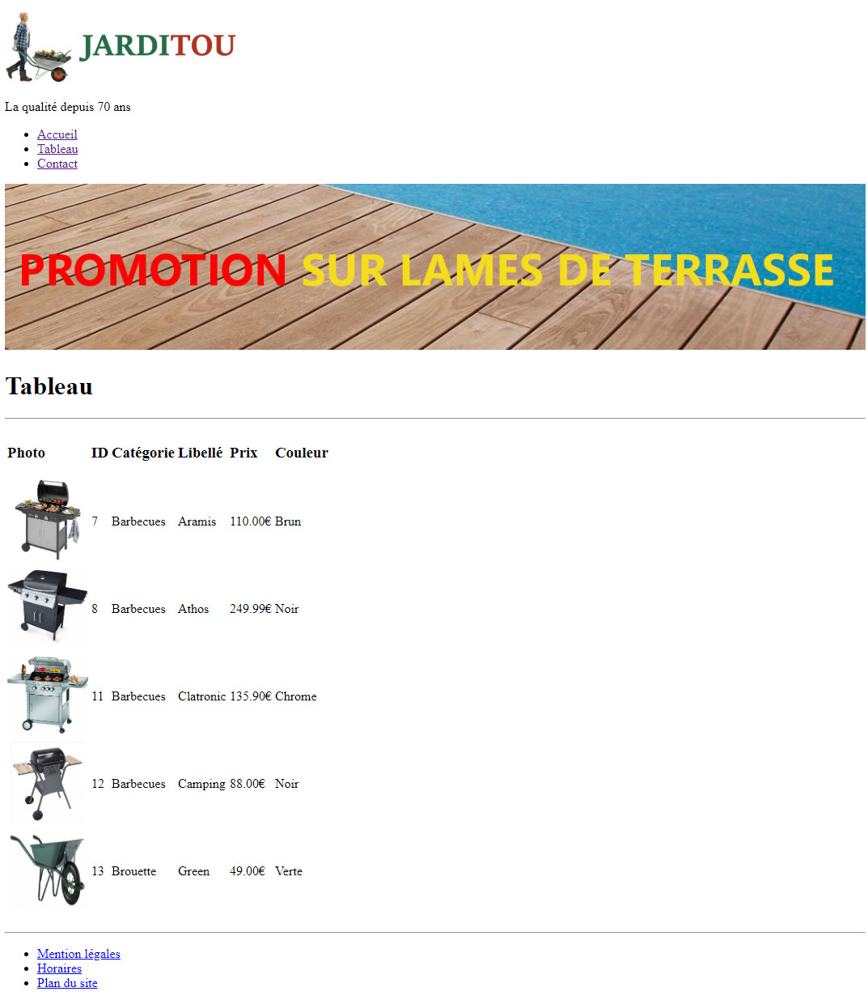
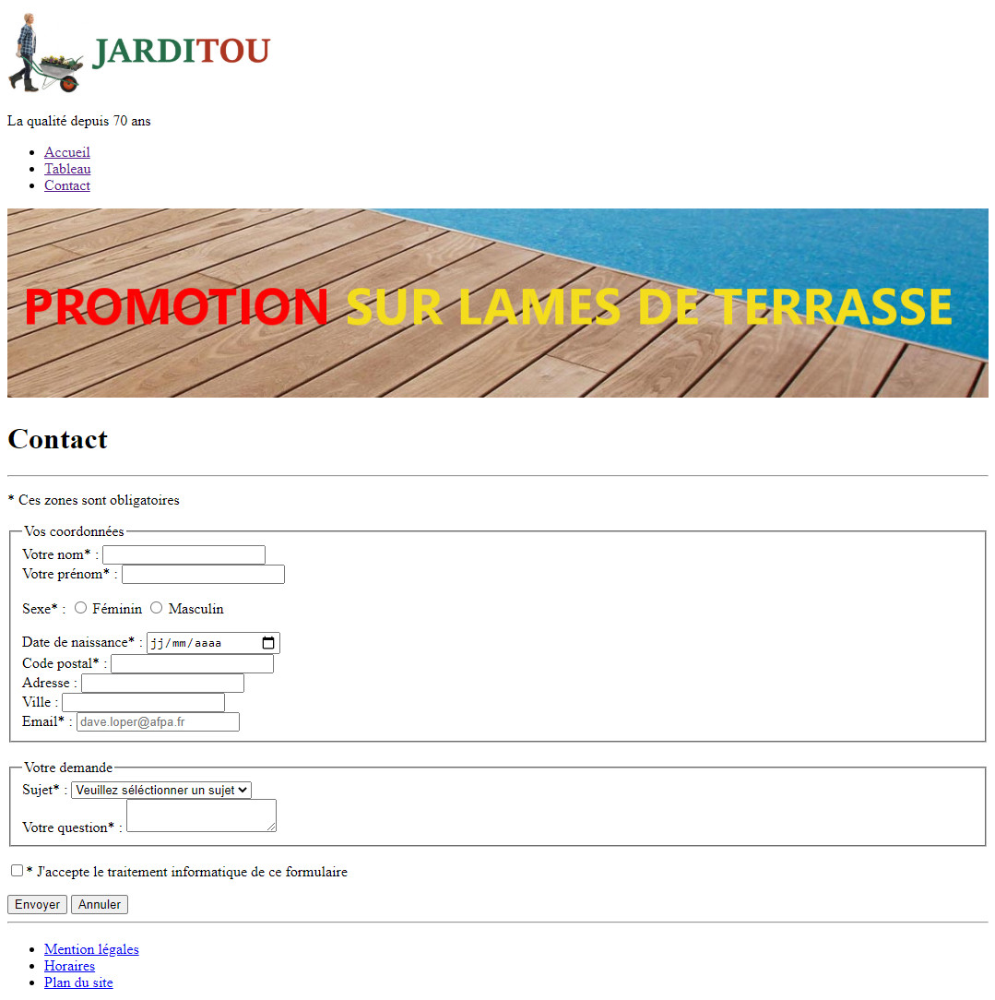

# HTML

## Objectifs
* Comprendre le principe des documents HyperTextes
* Connaître les différentes balises HTML5
* Réaliser des documents HTML simples

## Pré-requis

> Pour réaliser les différents exercices, vous aurez besoin d'utiliser un éditeur de texte.  
 
Utilisez de préférence *Visual studio code*, demandez à votre formateur de vous faire une démonstration de ce logiciel.

Rendez vous sur ce site [https://code.visualstudio.com/](https://code.visualstudio.com/) pour le télécharger .

## Cheminement

Demandez à votre formateur de vous faire une présentation de cette séance. 

Vous y découvrirez les différents outils à utiliser ainsi que quelques explications sur le langage de balisage `HTML`.

Ensuite, lisez les supports puis réalisez les exercices au fur et à mesure.

### Phase 1	- Présentation du HTML et structure d'une page

Lire le document [Présentation du HTML](HTML_01_presentation_structure.html).

### Phase 2	- Les balises et le sectionnement
Lire le document [les balises](HTML_02_balises_sectionnement.html).

### Phase 3	- Mise en forme du texte
Lire le document [mise en forme](HTML_03_mise_en_forme.html).

### Phase 4	- Liens
Lire le document HTML [les liens](HTML_04_liens.html).

### Phase 5	- Listes
Lire le document [les listes](HTML_05_listes.html).

### Phase 6	- Images et médias
Lire le document [images et médias](HTML_06_medias.html).

### Phase 7	- Tableaux
Lire le document [les tableaux](HTML_07_tableaux.html).

### Phase 8	- Formulaires
Lire le document [les formulaires](HTML_08_formulaires.html).

<!-- ### Phase 9	- Rôles et attributs "aria", attributs de données
 
Ces notions sont simplement à connaître. Lire les articles suivants :

* [Les rôles et les attributs aria](http://beta.rdsign.net/articles/utiliser-efficacement-aria-en-html5 "Les rôles et les attributs aria")
* [Les attributs de données](https://www.alsacreations.com/article/lire/1397-html5-attribut-data-dataset.html "Les attributs de données") -->

### Exercice d'application

> Vous aurez besoin des éléments contenus dans [cette archive](jarditou_html_zip.zip).

> Et de la structure du projet

Vous devez reproduire la page HTML suivante qui constitue la page d'accueil du site de l'entreprise _Jarditou_.

> Vous veillerez bien sûr à utiliser les balises HTML 5 telles que `<header>`, `footer>`, `<nav>`, `<section>`, `<article>` etc.  

**PAGE ACCUEIL :**

* Copiez le fichier HTML de cette première page et renommez la copie _tableau.html_.

Dans cette nouvelle page, insérez le tableau HTML de la phase 7 en remplacement du texte d'accueil.

**PAGE TABLEAU :**

* Renouvellez l'opération pour insérer le formulaire de la phase 8 dans une page nommée _contact.html_.

* Adaptez les liens de la barre de navigation pour permettre de naviguer entre les 3 pages du site.

**PAGE CONTACT :**   

* Après avoir réalisé les pages, faites `CTRL+U` dans Chrome ou Firefox pour afficher le code source, copiez le (`CTRL+A` et `CTRL+C`) puis rendez-vous sur le validateur HTML du W3C : choisir l'onglet `Validate by Direct Input` et copiez-y votre code. Cliquez sur le bouton `Check` et vérifiez qu'il n'y ait pas d'erreurs.   
**PAGE TABLEAU :**

## Ressources complémentaires
* Mémento HTML5 : [Français](HTML5-resume-fr.pdf) (ou [Anglais](HTML5-resume-en.pdf))
* [Liste des tags](https://www.w3schools.com/tags/default.asp)
	