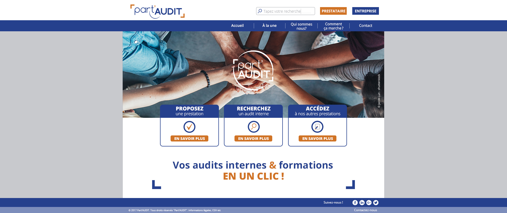
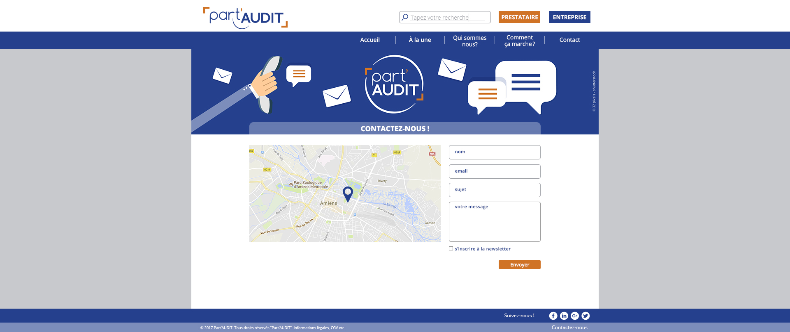

Réalisez à l'aide de vos connaissances les pages présentés:

échangez avec vos collègues de formation sur la marche à suivre, consultez les ressources proposées ou celles que vous trouverez sur Internet.
N'oubliez pas également de solliciter votre formateur en cas de difficultés (il est là pour ça).

Cet exercice à pour objectif de vous confronter à la structuration de vos pages à l'aide des balises HTML, au problème du choix des sélecteurs et des propriétés CSS sur lesquelles intervenir pour appliquer le style.
Les retours qui vous seront faits le seront essentiellement sur ces points.