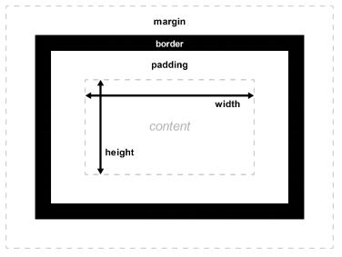

# CSS : les modèles de boîtes


## Introduction

Dans un document HTML, chaque élément est représenté par une boîte rectangulaire. Le
calcul de la taille, des propriétés (couleur, arrière-plan, forme du cadre) et de la position des
boîtes est le rôle du moteur de rendu. En CSS, chacune de ces boîtes est décrite à partir d'un
modèle standard qui permet de décrire le contenu de l'espace occupé par un élément.


Le modèle de boîte CSS est à l'origine de la disposition des contenus d'un document. Avant
d'aborder cette disposition, commençons par décrire le fonctionnement des boîtes.


## Le modèle standard
Chaque élément d'un document est matérialisé par une boîte qui peut être ajustée grâce à des propriétés CSS spécifiques. Ces propriétés peuvent être représentées ainsi :



### La boîte de contenu `height` & `width`

La boîte de contenu est l'endroit où le contenu de l'élément est affiché. Ce contenu est le
texte de l'élément ou les autres boîtes des éléments fils. La taille de la boîte de contenu est
définie avec les propriétés CSS width (pour la largeur) et height (pour la hauteur).

Il existe d'autres propriétés qui permettent de gérer la taille de la boîte de contenu en fonction de contrainte (plutôt que d'exprimer une taille absolue). On peut donc aussi utiliser les
propriétés : min-width/max-width (pour limiter les valeurs de largeur) et min-height/maxheight (pour limiter les valeurs de hauteur).

### La boîte de remplissage `padding`
Le remplissage d'une boîte est une zone, visible ou non, qui représente la limite de la boîte.
`padding` est la version raccourcie des propriétés `padding-top`, `padding-left`, `padding-bottom` et `padding-right` qui vont servir à définir les marges internes de chaque côté d’un élément.

### La bordure `border`
La bordure d'une boîte est une zone, visible ou non, qui représente la limite de la boîte. Par
défaut, la taille de la bordure vaut 0, ce qui la rend invisible. La bordure est définie grâce à la
propriété CSS border. Cette propriété est aussi une propriété raccourcie composée de border-size (l'épaisseur de la bordure), border-style (le style à appliquer pour la ligne de la bordure, généralement solid) et border-color (la couleur). 

Il est également possible de définir
chaque côté séparément et il existe donc un ensemble de propriétés border-* pour chacun
des côtés (top pour le haut, right pour la droite, bottom pour le bas et left pour la gauche).

### La marge extérieure `margin`
La marge (extérieure) représente la distance qui doit séparer deux boîtes. La marge similaire
au remplissage mais se situe à l'extérieur de la bordure. La propriété raccourcie est margin
et les propriétés individuelles sont margin-top, margin-right, margin-bottom et margin-left.

La plupart du temps, les marges s'encastrent (margin collapsing). Autrement dit, quand deux
boîtes se suivent, la distance entre elles n'est pas la somme des deux marges adjacentes
mais la marge la plus grande.


Prenons un exemple pour illustrer ces différentes quantités :

```html
<p>Je suis un paragraphe</p>
<p>Je suis un autre paragraphe</p>
```
La feuille de style CSS :
```css
/* Pour tous les paragraphes */
p {
 /* Ils auront exactement une largeur de 100px */
 width: 100px;
 /* Hauteur définie automatiquement en fonction de la taille du contenu */
 height: auto;
 /* La distance entre le contenu et la bordure est 
 20px à droite et à gauche et est 
 10px en haut et en bas */
 padding: 10px 20px 10px 20px;
 /* On définit une bordure noire, large de 5px */
 border: 5px solid black;
 /* La distance minimale entre un paragraphe
 et une autre boîte au-dessus ou en-dessous
 sera de 20px */
 margin: 20px 0 20px 0;
}
```
Ce document HTML, associé à cette feuille de style donnera le résultat suivant :
<style>.exemple {
 width: 100px;
 height: auto;
 padding: 10px 20px;
 border: 5px solid black;
 margin: 20px 0 20px 0;
}</style>
<p class="exemple">Je suis un paragraphe</p>
<p class="exemple">Je suis un autre paragraphe</p>

>Exercice : Inspecter les paragraphes ci dessus pour voir les differentes boîtes ( `F12` sur google chrome ou `CTRL + Maj + C` sur Mozilla Firefox )

## Les différentes interactions
En CSS, gérer des boîtes ne se limite pas qu'à définir leur taille. Il s'agit également qu'elles
soient réactives.
### Les dépassements
Lorsqu'on définit la taille d'une boîte en utilisant des valeurs absolues, il peut arriver que le
contenu ne tienne pas dans l'espace alloué. Dans ces cas, le contenu dépasse de la boîte.

Pour décider ce qui se produit alors, on peut utiliser la propriété overflow : 

> La propriété CSS overflow est une propriété raccourcie qui définit comment gérer le dépassement du contenu d'un élément dans son bloc.

Celle-ci peut prendre différentes valeurs mais les valeurs qu'on rencontre le plus souvent sont :
* `auto`
Le comportement est laissé à la discrétion de l'agent utilisateur. Les navigateurs comme Firefox affichent des ascenseurs si le contenu dépasse dans la boîte de remplissage (padding)

* `hidden`
Le contenu est rogné si besoin pour s'inscrire dans la boîte de remplissage (padding) et aucune barre de défilement n'est affichée.

* `visible`
La valeur par défaut. Le contenu n'est pas rogné. Le contenu peut éventuellement être affiché en dehors de la boîte de remplissage (padding).

Voici un exemple pour illustrer ce concept.

Ci-dessous le code HTML qu'on utilisera :
```html
<p class="autoscroll">
 Lorem ipsum dolor sit amet, consectetur adipiscing elit.
 Mauris tempus turpis id ante mollis dignissim. Nam sed
 dolor non tortor lacinia lobortis id dapibus nunc. Praesent
 iaculis tincidunt augue. Integer efficitur sem eget risus
 cursus, ornare venenatis augue hendrerit. Praesent non elit
 metus. Morbi vel sodales ligula.
</p>

<p class="clipped">
 Lorem ipsum dolor sit amet, consectetur adipiscing elit.
 Mauris tempus turpis id ante mollis dignissim. Nam sed
 dolor non tortor lacinia lobortis id dapibus nunc. Praesent
 iaculis tincidunt augue. Integer efficitur sem eget risus
 cursus, ornare venenatis augue hendrerit. Praesent non elit
 metus. Morbi vel sodales ligula.
</p>

```
Et la feuille de style :
```css
p {
 width : 400px;
 height : 2.5em;
 padding: 1em 1em 1em 1em;
 border : 1px solid black;
}

.autoscroll { overflow: auto; }
.clipped { overflow: hidden; }
```

On obtient alors :
<p class="pp autoscroll">
 Lorem ipsum dolor sit amet, consectetur adipiscing elit.
 Mauris tempus turpis id ante mollis dignissim. Nam sed
 dolor non tortor lacinia lobortis id dapibus nunc. Praesent
 iaculis tincidunt augue. Integer efficitur sem eget risus
 cursus, ornare venenatis augue hendrerit. Praesent non elit
 metus. Morbi vel sodales ligula.
</p>

<p class="pp clipped">
 Lorem ipsum dolor sit amet, consectetur adipiscing elit.
 Mauris tempus turpis id ante mollis dignissim. Nam sed
 dolor non tortor lacinia lobortis id dapibus nunc. Praesent
 iaculis tincidunt augue. Integer efficitur sem eget risus
 cursus, ornare venenatis augue hendrerit. Praesent non elit
 metus. Morbi vel sodales ligula.
</p>


<style>
.pp {
 width : 400px;
 height : 2.5em;
 padding: 1em 1em 1em 1em;
 border : 1px solid black;
}
.autoscroll { overflow: auto; }
.clipped { overflow: hidden; }
</style>


### Les types de boîte
Tout ce que nous avons vu jusqu'à présent s'applique aux boîtes qui sont des blocs. Cependant, il existe d'autres types de boîte en CSS et ceux-ci se comportent différemment. Le type
de boîte qui s'applique pour un élément est déterminé par la propriété display. CSS fournit
de nombreuses valeurs pour cette propriété. Dans cet article, nous nous concentrerons
avant tout sur les deux valeurs basiques que sont block et inline.


* `block` Une boîte block (ou bloc) est définie comme une boîte qui va s'empiler sur
d'autres boîtes (autrement dit, on crée une cassure de la ligne visuelle avant
et après la boîte). Le modèle de boîte vu juste avant s'applique.

Quelques exemples de balises block :
```html
    <div></div>
    <p></p>
    <footer></footer>
    <h1></h1>
    <h2></h2>
    <article></article>
```
* `inline` Une boîte inline (ou en ligne) est l'opposée d'une boîte bloc : elle flotte dans
le texte du document (autrement dit, elle ne crée pas de cassure de ligne
visuelle avant et après la boîte et le contenu de cette boîte passera à la ligne
selon le contenu qui l'entoure). Les propriétés du modèle de boîte s'appliquent mais n'impactent pas les boîtes environnantes.

Quelques exemples de balises inline :
```html
    <span></span>
    <em></em>
    <strong></strong>
    <mark></mark>
    <a></a>
    
```
Par exemple,

Nous utiliserons ce document HTML :
```html
<p>
 Lorem ipsum dolor sit amet, consectetur adipiscing elit.
 <span class="inline">Mauris tempus turpis id ante mollis dignissim.</span> Nam sed dolor non tortor lacinia lobortis id dapibus nunc.
</p>
<p>
 Lorem ipsum dolor sit amet, consectetur adipiscing elit.
 <span class="block">Mauris tempus turpis id ante mollis dignissim.</span>
 Nam sed dolor non tortor lacinia lobortis id dapibus nunc.
</p>
```

Et cette feuille de style CSS :

```css
p {
 padding : 1em;
 border : 1px solid black;
}
span {
 padding : 0.5em;
 border : 1px solid green;
 /* On rend la boîte visible, quel que soit son type */
 background-color: yellow;
}
.inline {
 display: inline;
}
.block {
 display: block;
}
```

On obtiendra alors le résultat suivant :


## Le modèle de boîte flexible : Flexbox

### Présentation
CSS 3 a introduit un nouveau modèle de boîte, FlexBox (pour Flexible Box) afin de répondre aux besoins du design responsive.

Ce modèle est différent du modèle de boîte standard, il fournit une façon efficace de disposer, aligner et distribuer l'espace entre les items d'un container, même lorsque leurs
dimensions sont inconnues et/ou dynamiques (redimensionnables).

Les éléments enfants d’une flexbox peuvent être placés dans n’importe quelle direction et
peuvent avoir des dimensions pour s'adapter à la place disponible.

 - En savoir plus sur Flexbox

[https://css-tricks.com/snippets/css/a-guide-to-flexbox/](https://css-tricks.com/snippets/css/a-guide-to-flexbox/)


### Exercice : A toi de jouer !
[https://flexboxfroggy.com/#fr](https://flexboxfroggy.com/#fr)

# A retenir

>En CSS, on peut modifier la mise en forme de l’élément ciblé en jouant sur son contenu ( `height` et `width` ), ses marges intérieures ( `padding` ), sa bordure ( `border` ) et ses marges extérieures ( `margin` ).

>Les dépassements grâce à la propriété ( `overflow` ) permet de gérer le dépassement du contenu d'un élément dans son bloc.
Il existe différentes façon de gérer les dépassements  `auto`, `hidden`, `visible`, `scroll`.

>Les types de boîte peuvent être de type `block` ou `inline` , il est possible d'inverser le type d'affichage de la balise grâce à la propriété `display`.