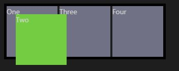

# CSS : le positionnemennt

La propriété position définit la façon dont un élément est positionné dans un document.

Par défaut, les navigateurs affichent :
* les boîtes de type `bloc` dans une succession verticale.
* les boîtes de type `inline` dans une succession horizontale.


## position: static

**Comportement normal (par défaut). L'élément est alors positionné dans le flux avec sa position. Les propriétés top, right, bottom, left et z-index ne s'appliquent pas. — source MDN**

```html
<div class="parent">
 <div class="box" id="one">One</div>
 <div class="box" id="two">Two</div>
 <div class="box" id="three">Three</div>
 <div class="box" id="four">Four</div>
</div>
```
```css
.parent {
 border: 5px black solid;
 display: inline-block;
}
.box {
 display: inline-block;
 background: rgb(113,113,133);
 width: 100px;
 height: 100px;
}
#two {
  background: #74CC42;
}
```
<div class="parent">
 <div class="box" id="one">One</div>
 <div class="box" id="two">Two</div>
 <div class="box" id="three">Three</div>
 <div class="box" id="four">Four</div>
</div>
<style>
.parent {
 border: 5px black solid;
 display: inline-block;
}
.box {
 display: inline-block;
 background: rgb(113,113,133);
 width: 100px;
 height: 100px;
}
#two {
  background:  #74CC42;
}
</style>


## position: relative

**Elle place un élément en fonction de sa position actuelle sans modifier la disposition.**


> Par exemple, on déplace la boîte verte par rapport à sa position actuelle de 20 pixels à partir de la gauche et du haut sans modifier la disposition autour d'elle. 


```css
#two {
  top: 20px;
  left: 20px;
  background: #74CC42;
  position: relative;
}
```

> Ainsi, laisser un espace pour la boîte verte. ( la où elle aurait été si elle n'avait pas été positionnée en relative )

<div class="parent">
 <div class="box" id="one">One</div>
 <div class="box" id="two_relative">Two</div>
 <div class="box" id="three">Three</div>
 <div class="box" id="four">Four</div>
</div>
<style>
    #two_relative {
  top: 20px;
  left: 20px;
  background: #74CC42;
  position: relative;
}
    </style>

## position: absolute

**Positionne un élément en fonction de sa position d'ancêtre la plus proche. ( `class="parent"` )**

>En appliquant `position: absolute` à la boîte verte, elle ne laissera aucun écart ! ( là où elle aurait été ) 

```css
#two {
  top: 20px;
  left: 20px;
  background: #74CC42;
  position: absolute;
}
```

>La position de la boîte verte **est basée sur sa position parente** ( la bordure ). Ainsi, déplacer 20 pixels vers la gauche et le bas depuis l'origine en haut à gauche de la bordure en pointillés.

<!-- <div class="parent">
 <div class="box" id="one">One</div>
 <div class="box" id="two_absolute">Two</div>
 <div class="box" id="three">Three</div>
 <div class="box" id="four">Four</div>
</div>
<style>
#two_absolute {
  top: 1700px;
  left: 75px;
  background: #74CC42;
  position: absolute;
}
    </style> -->



## Pour aller plus loin

[Position : static | relative | absolute | sticky | fixed](https://developer.mozilla.org/fr/docs/Web/CSS/position)