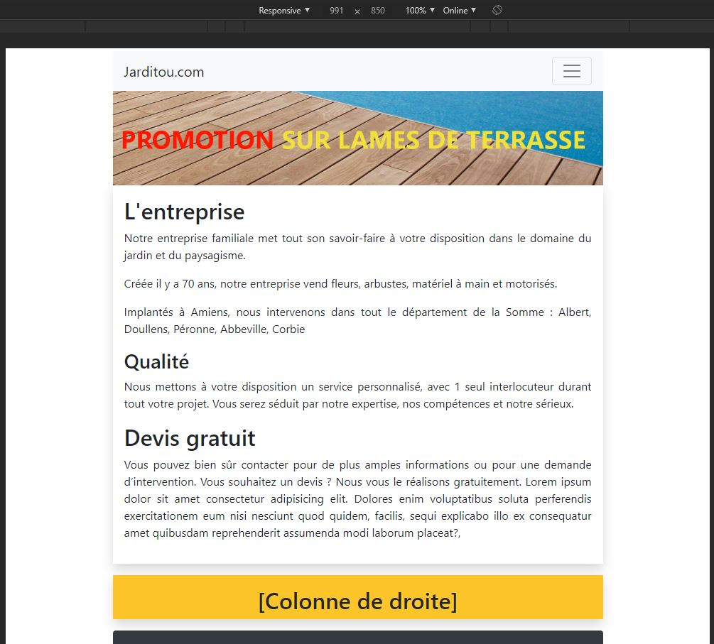

# Responsive / Bootstrap

## Objectifs

* Maîtriser un framework CSS implémentant les contraintes du web responsive
* Utiliser un système de grille

## Cheminement

Le framework CSS [Bootstrap](https://getbootstrap.com/docs/4.4/getting-started/introduction/ "Bootstrap") vous permet de mettre en oeuvre facilement des sites dits "responsive", c'est-à-dire avec une mise en page qui s'adapte automatiquement en fonction des écrans (PC, smartphones, tablettes).
Bootstrap est le framework d'interface le plus populaire mais il en existe beaucoup d'autres. (Materialize, Semantic UI, PureCSS, Skeleton etc...)

# Qu'est-ce que Bootstrap ?
Ce document est basé pour la version 4.x de Bootstrap. En fonction de l'évolution des versions des points peuvent avoir changé. 

Afin d'aider dans la conception « front-end », des frameworks (« librairies ») CSS ont été créés, le plus populaire en termes d'utilisation étant Bootstrap.

Bootstrap a été développé en 2010 par deux ingénieurs de Twitter qui souhaitaient répondre à la problématique d'une librairie servant de base commune à tous les projets de leur société.   

Bootstrap permet principalement de structurer une page HTML en la rendant adaptable aux différentes tailles d'écran (_web responsive_) grâce à un découpage en grille, le _grid system_. 

Outre le web responsive, Bootstrap embarque une multitude d'aides pour la conception front-end entre autres : 

* menus (accordéons etc.) 
* gestion des polices, couleurs etc.
* messages (alertes, infobulles)
* gestion des marges et paddings 
* habillage des formulaires 
* habillage des tableaux 
* gestion des images 
* placements de contenus (medias, cards) 
* popup/fenêtres modales (iframes) 
* carrousels (diaporamas) etc.
  
## Phase 1- Intégrer Bootstrap dans une page web

Lisez le document [Intégrer Bootstrap dans une page web](integrer.html)
## Phase 2 - Le système de grille

Lisez le document [Le système de grille](grille.html)

## Phase 3 - Marges (spacing)
Lisez le document sur les [Marges](marge.html)

## Phase 4 - Différentes classes de Boostrap 4
Lisez le document [Différentes classes de Boostrap 4](class_bs.html)

## Phase 5 - Mise en pratique

Reprenez la maquette _Jarditou_ ci dessous et reproduisez la en creant un nouveau projet et en utilisant **UNIQUEMENT** le framework Bootstrap ( ajout feuille de style css pas necessaire pour realiser la maquette ): 

Votre page HTML devra respecter les consignes suivantes :

* Etre responsive bien sûr, pour tout les éléments : menu, images, tableaux, formulaires.
* N'utiliser qu'un seul conteneur. 
* La partie centrale aura une largeur de 8 et la colonne de droite une largeur de 4 sur les écrans supérieurs à 992px. En dessous, les colonnes auront une largeur égale. ( largeur de 12 et 12)

**Exemple d'aperçu sur Mobile**

## Ressources

* [Bootstrap](https://getbootstrap.com "Bootstrap")
* [w3schools](https://www.w3schools.com/bootstrap4 "w3schools")
* **Hackerthemes** : [Bootstrap4 Cheat Sheet](https://hackerthemes.com/bootstrap-cheatsheet "Bootstrap4 Cheat Sheet") et [Bootstrap 4 Buffet](https://hackerthemes.com/bootstrap-buffet/#alerts "Bootstrap 4 Buffet"), permet de sélectionner des éléments Bootstrap plus facilement.

<!-- MAJ : 21/04/2020 -->